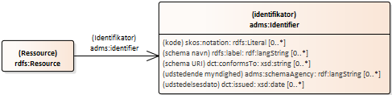
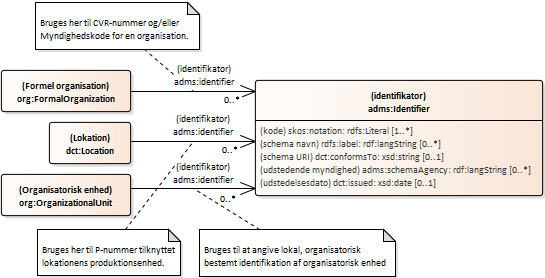

# Repræsentation af identifikatorer og referencer
It-systemer forvaltet og anvendt af danske offentlige organisationer anvender mange typer af koder. Enten til at identificerer et objekt i systemet eller som reference til et objekt – oftest eksternt i forhold til it-systemet. 
I relation til organisationsbeskrivende data anvendes cvr-nummer, p-nummer og myndighedskode ofte som den identifikationskode – eller identifikator – de er tænkt anvendt som. Men de anvendes også som andet end en entydig identifikator for objektet. Eksempelvis kan et adresse-objekt, have tilføjet en myndighedskode i form af en kommunekode. Kommunekoden er i det tilfælde ikke en identifikator for selve adresse-objektet, men bruges som en information om hvilken kommune adressen ligger i. Myndighedskoden/kommunekoden bruges altså som en reference til et andet objekt der har koden som identifikator. 
Brugen af egenskaber, som cvr-nummer, p-nummer og myndighedskode, på den beskrevne måde er ikke forkert – **indenfor det pågældende systems rammer, med de regler og fortolkninger der er tilknyttet systemet.** Men når de samme data bruges udenfor systemet, så er der brug for en måde at skelne mellem en egenskab der fungerer som identifikator og en egenskab der refereres til.  
Når disse koder, disse data skal indgå i en sammenhæng hvor semantisk interoperabilitet er et mål, så bør så mange data som muligt gøres entydigt maskinfortolkelige. Mere præcist udtrykt så bør det i basisprofilen gøres klart hvornår en kode optræder som identifikator for et objekt og hvornår koden er en reference til et objekt. 
Det foreslås derfor at egenskaber der repræsenterer cvr-nummer, p-nummer og myndighedskode i sig selv er identifikatorer for objekterne de bruges på og at de suppleres med egenskaber der fungerer som referencer til samme objekter. Dermed sikres der entydighed i tolkning samtidigt med at de to eksisterende anvendelser – og de bagvedliggende behov – respekteres. 
Til at repræsentere de tre typer af koder som identifikatorer vil basisprofilen anvende en af EU-defineret identifikatorklasse: adms:Identifier. Dette beskrives nærmere i afsnittet _Standardisering af lokale identifikatorer_. 
Til a repræsentere koderne anvendt som referencer defineres følgende egenskaber relateret til de tre identifikatorer cvr-nummer, p-nummer og myndighedskode:

| Beskrivelse | Forkortet URI | URI (foreslået) |
| --- | --- | --- |
| reference til objekt med cvr-nummer | `ovx:cvrCodeReference` | `https://data.gov.dk/model/core/organisation/extension/cvrCodeReference` |
| reference til objekt med p-nummer | `ovx:pUnitCodeReference` | `https://data.gov.dk/model/core/organisation/extension/pUnitCodeReference` |
| reference til objekt med myndighedskode | `ovx:authCodeReference` | `https://data.gov.dk/model/core/organisation/extension/authCodeReference` |

> [!NOTE]
> Alternativt til - eller som supplement til - brugen af koder som referencer, kan der i kommende udgaver af basisprofilen indføres direkte link/relationer. Eksempelvis et link fra en organisatorisk enhed til en lokation med p-nummer.
## Standardisering af tegnbaserede identifikatorer
Basisprofilen for organisation anvender den af EUs _Semantic Interoperability Community_ (SEMIC)[^7] definerede `adms:Identifier`-klasse[^8]. Klassen er defineret med henblik på at have en enkelt funktion, et enkelt element, til at repræsentere de mange typer af tegnbaserede identifikatorer der anvendes på tværs af organisationer, it-systemer og medlemslande. Klassen er defineret i vokabularet _Asset Description Metadata Schema_ (ADMS). Vokabularet varetages af SEMIC-fællesskabet. 
Klassen benyttes eksempelvis i SEMIC-vokabularer og anvendelsesprofiler, herunder i _Core Person Vocabulary_[^9], _Core Public Organisation Vocabulary_ og _Core Business Vocabulary_.[^10] 
I denne udgave af basisprofilen anvendes klassen til følgende identifikatorer:
*	cvr-nummer
*	p-nummer
*	myndighedskode (herunder ‘kommunekode og ‘regionskode’)
*	samt til lokal, organisatorisk bestemt identifikation af organisatorisk enhed
Brug af klassen adms:Identifier har til hensigt at give både fleksibilitet og beriget information hvor identifikatorer anvendes.
### Anvendelse
Ressourcer eller objekter kan effektivt og entydigt identificeres ved anvendelse af direkte ’resolverbare’ HTTP-URIer. Disse URIer fungerer ikke blot som entydige identifikatorer, men kan også bruges som link til ressourcen eller objektet, hvorefter yderligere information om ressourcen kan findes.  
Etablerede it-systemer der ønskes inddraget i et miljø med semantisk interoperabilitet kan ikke forventes at omdanne sine tegnbaserede identifikatorer til resolverbare HTTP-URIer. Generelt kan brugen af klassen adms:Identifier ses som en mulighed for at forbinde de tegnbaserede identifikatorer med relevante maskinfortolkelige informationer. 
I SEMIC-regi gøres dette som vist her:

  

Egenskaben adms:identifier anvendes på det objekt (den ressource) der har en tegnbaseret identifikator der skal beskrives. 
Klassen adms.Identifier bruges i SEMIC-regi med fem egenskaber:

| Egenskab | Beskrivelse |
| --- | --- |
| kode  (= `skos:notation` | den tegnbaserede identifikator kombineret med en brugerdefineret datatype. Datatypen er en HTTP-URI der kan bruges til at hente yderligere beskrivelser om datatypen, eksempelvis RegEx mønstre. |
| schema navn  = `rdfs:label` | navnet på det schema der fastlægger udformningen af identifikatoren |
| schema URI  = `dct:conformsTo` | URI for det schema der fastlægger udformningen af identifikatoren |
| udstedende myndighed  = `adms:schemaAgency` | navn på den myndighed der har udstedt identifikatoren |
| udstedelsesdato  `= dct:issued` | dato for identifikatorens oprettelse |

Hvis eksempelvis Digitaliseringsstyrelsens cvr-nummer skulle vises som en instans af adms:Identifier, ville instansen indeholde følgende:

| Egenskab | værdi |
| --- | --- |
| kode | ”34051178"^^id-dk:cvrCode |
| schema navn *) |  |
| schema URI *) |  |
| udstedende myndighed | Danmarks Statistik |
| udstedende myndighed | Statistics Denmark |
| udstedelsesdato | 2011-12-01 |

*) Der er ikke fundet noget officielt schema der definerer ’cvr-nummer’.
### Koden og de brugerdefinerede datatyper
Oversat fra _SKOS Simple Knowledge Organization System Reference_[^11]:
>Konventionelt bruges egenskaben `skos:notation` kun med […] en brugerdefineret datatype svarende til et bestemt system af notationer eller klassifikationskoder. 
I mange situationer kan det være tilstrækkeligt blot at sammensætte en datatype-URI for et bestemt notationssystem, og definere datatypen uformelt via et dokument, der beskriver, hvordan notationerne er opbygget og/eller hvilke leksikalske former, der er tilladt. Bemærk dog, at det også er muligt at definere i det mindste det leksikalske rum af en datatype mere formelt via XML Schema-sproget.

Til ovenstående kan tilføjes at det også er muligt (og foretrukket) at definere den brugerdefinerede datatypes ’leksikalske former’ med SHACL.  
Til brug for danske fællesoffentlige brugerdefinerede datatyper foreslås følgende navnerum og URIer.

| Præfiks (foreslået) | Navnerum (foreslået) |
| --- | --- |
| id-dk | `https://gov.data.dk/datatype/id/` |

| Identifikation | Forkortet URI (foreslået) | URI (foreslået) |
| --- | --- | --- |
| cvr-nummer | `id-dk:cvrCode` | `https://gov.data.dk/datatype/id/cvrCode` |
| p-nummer | `id-dk:pUnitCode` | `https://gov.data.dk/datatype/id/pUnitCode`  |
| myndighedskode | `id-dk:authCode` | `https://gov.data.dk/datatype/id/authCode`   |

#### Lokal, organisatorisk bestemt identifikation af organisatorisk enhed
> [!NOTE]
> Datatype(r) for lokaltdefinerede identifikatorer, samt administrationspricipper for samme udestår.

## Beskrivelse af klasse og egenskaber til identifikation

  

#### identifikator
##### Vokabular-definition og beskrivelser
<table>
<tr>
    <td> URI </td>
    <td>http://www.w3.org/ns/adms#identifier</td> 
</tr>
<tr>
    <td> Term </td>
    <td>identifikator</td> 
</tr>
<tr>
    <td> Kommentar </td>
    <td>Linker en ressource til en adms:Identifier-klasse.</td> 
</tr>
<tr>
    <td> Domæne</td>
    <td> rdfs:Ressource</td> 
</tr>
<tr>
    <td> Udfaldsrum</td>
    <td> adms:Identifier </td> 
</tr>
</table>

##### Profil-restriktioner og annotationer
<table>
<tr>
    <td> Domæne </td>
    <td> org:FormalOrganization   eller   org:OrganizationalUnit   eller   dct:Location </td>
</tr>
<tr>
    <td>Udfaldsrum</td>
    <td> adms:Identifier </td>
</tr>
<tr>
    <td> Multiplicitet </td>
    <td>0 - *</td>
</tr>
</table>

#### Identifikator (klasse)
##### Vokabular-definition og beskrivelser
<table>
<tr>
    <td> URI </td>
    <td>http://www.w3.org/ns/adms#Identifier</td>
</tr>
<tr>
    <td> Term </td>
    <td> Identifkator </td>
</tr>
<tr>
    <td> Kommentar </td>
    <td> Dette er baseret på UN/CEFACT Identifier-klassen.</td>
</tr>
</table>

##### Profil-restriktioner og annotationer 
<table>
<tr>
    <td> Definition</td>
    <td>[fra Core Public Organisation Vocabulary websiden] <br/ >
      En struktureret reference, der identificerer en enhed.  </td>
</tr>
<tr>
    <td>Anvendelsesnote</td>
    <td>[fra ADMS Vocabulary-websiden]
      
En identifikator i en bestemt kontekst, bestående af
      
*	indholdsstreng, der er identifikatoren;
*	en valgfri identifikator for identifikationssystemet;
*	en valgfri identifikator for versionen af identifikationsskemaet;
*	en valgfri identifikator for det bureau, der administrerer identifikationsordningen. </td>
</tr>
<tr>
    <td>Anvendelsesnote</td>
    <td> Klassen adms:Identifier anvendes i denne udgave af basisprofilen til følgende identifikatorer: cvr-nummer, p-nummer og myndighedskode, samt til lokalt/organisatorisk definerede brugervendte nøgler for organisatoriske enheder.</td>
</tr>
</table>

#### notation 
##### Vokabular-definition og beskrivelser
<table>
<tr>
<td> URI </td>
<td> http://www.w3.org/2004/02/skos/core#notation </td>
</tr>
<tr>
<td> Term </td>
<td> notation  </td>
</tr>
<tr>
<td> Definition </td>
<td> En notation, også kendt som klassifikationskode, er en streng af tegn såsom "T58.5" eller "303.4833", der bruges til entydigt at identificere et begreb inden for rammerne af et givet begrebssystem. </td>
</tr>
<tr>
<td> Anvendelsesnote </td>
<td> Efter konvention bruges skos:notation med en typeangivet literal i objekt-positionen af en triple. </td>
</tr>
<tr>
<td> Domæne </td>
<td> rdfs:Resource  </td>
</tr>
<tr>
<td> Udfaldsrum </td>
<td> rdfs:Resource </td>
</tr>
</table>

##### Profil-restriktioner og annotationer 
<table>
<tr><td>Alternativ term</td><td>kode</td></tr>
<tr><td>Anvendelsesnote</td><td>[fra ADMS Vocabulary-websiden]
En streng, der er en identifikator i sammenhæng med identifikationsskemaet, der refereres til af dens datatype.</td></tr>
<tr><td>Domæne</td><td>adms:Identifier</td></tr>
<tr><td>Udfaldsrum</td><td>rdfs:Literal</td></tr>
<tr><td>Multiplicitet</td><td>1 - *</td></tr>
</table>

#### schema navn
##### Vokabular-definition og beskrivelser
<table>
<tr><td>URI</td><td>http://www.w3.org/2000/01/rdf-schema#label</td></tr>
<tr><td>Term</td><td>etiket</td></tr>
<tr><td>Kommentar</td><td>Et menneskelæsbart navn for emnet.</td></tr>
<tr><td>Domæne</td><td>rdfs:Resource</td></tr>
<tr><td>Udfaldsrum</td><td>rdfs:Literal</td></tr>
</table>

##### Profil-restriktioner og annotationer 
<table>
<tr><td>Alternativ term</td><td>schema navn</td></tr>
<tr><td>Definition</td><td>[fra Core Public Organisation Vocabulary websiden]
Navn på det skema, der blev brugt til at konstruere identifikatoren.</td></tr>
<tr><td>Domæne</td><td>adms:Identifier</td></tr>
<tr><td>Udfaldsrum</td><td>rdf:langString</td></tr>
<tr><td>Multiplicitet</td><td>0 - *</td></tr>
</table>

#### udstedelsesdato 
##### Vokabular-definition og beskrivelser
<table>
<tr><td>URI</td><td>http://purl.org/dc/terms/issued</td></tr>
<tr><td>Term</td><td>udstedelsesdato</td></tr>
<tr><td>Kommentar</td><td>Dato for formel udstedelse (f.eks. offentliggørelse) af ressourcen.</td></tr>
<tr><td>Domæne</td><td>rdfs:Resource</td></tr>
<tr><td>Udfaldsrum</td><td>rdfs:Literal</td></tr>
<tr><td>Underegenskab af</td><td>dct:date</td></tr>
</table>

##### Profil-restriktioner og annotationer 
<table>
<tr><td>Alternativ term</td><td>udstedelsesdato</td></tr>
<tr><td>Definition</td><td>[fra Core Public Organisation Vocabulary websiden]
Den dato, hvor identifikatoren blev tildelt.</td></tr>
<tr><td>Domæne</td><td>adms:Identifier</td></tr>
<tr><td>Udfaldsrum</td><td>xsd:date</td></tr>
<tr><td>Multiplicitet</td><td>0 - 1</td></tr>
</table>

#### udstedende myndighed
##### Vokabular-definition og beskrivelser
<table>
<tr><td>URI</td><td>http://www.w3.org/ns/adms#schemaAgency</td></tr>
<tr><td>Term</td><td>Skema agentur</td></tr>
<tr><td>Kommentar</td><td>Navnet på det bureau, der har udstedt identifikatoren.</td></tr>
<tr><td>Domæne</td><td>adms:Identifier</td></tr>
<tr><td>Udfaldsrum</td><td>rdfs:Literal</td></tr>
<tr><td>Ækvivalent egenskab</td><td>adms:schemeAgency</td></tr>
</table>

##### Profil-restriktioner og annotationer 
<table>
<tr><td>Alternativ term</td><td>udstedende myndighed</td></tr>
<tr><td>Definition</td><td>[fra Core Public Organisation Vocabulary websiden]
Navnet på den autoritet, der er ansvarlig for at udstede identifikatoren.</td></tr>
<tr><td>Domæne</td><td>adms:Identifier</td></tr>
<tr><td>Udfaldsrum</td><td>rdf:langString</td></tr>
<tr><td>Multiplicitet</td><td>0 - *</td></tr>
</table>

#### schema URI
##### Vokabular-definition og beskrivelser
<table>
<tr><td>URI</td><td>http://purl.org/dc/terms/conformsTo</td></tr>
<tr><td>Term</td><td>er i overensstemmelse med</td></tr>
<tr><td>Kommentar</td><td>En etableret standard, som den beskrevne ressource er i overensstemmelse med.</td></tr>
<tr><td>Domæne</td><td>rdfs:Resource</td></tr>
<tr><td>Udfaldsrum</td><td>dct:Standard</td></tr>
<tr><td>Underegenskab af</td><td>dct:relation</td></tr>
</table>

##### Profil-restriktioner og annotationer 
<table>
<tr><td>Term</td><td>schema URI</td></tr>
<tr><td>Definition</td><td>[fra Core Public Organisation Vocabulary websiden]
URI for det skema, der bruges til at konstruere identifikatoren.</td></tr>
<tr><td>Anvendelsesnote</td><td>URIen angives i form af en tekststreng.</td></tr>
<tr><td>Eksempel</td><td></td></tr>
<tr><td>Domæne</td><td>adms:Identifier</td></tr>
<tr><td>Udfaldsrum</td><td>xsd:anyURI</td></tr>
<tr><td>Multiplicitet</td><td>0 - *</td></tr>
</table>

> [!IMPORTANT]
> Bemærk at SEMIC angiver at egenskaben ’dct:conformsTo’ kan have ’xsd:anyURI’ som udfaldsrum. Det synes at stride imod Dublin Core Terms definitionen hvor ’range’ er ’dct:Standard’ (en klasse).
> Egenskaben dct:conformsTo er en underegenskab til dct:relation og må derfor ikke være i konflikt med denne. I en note til egenskaben ’dct:relation’ hedder det: 
> ”Dette udtryk er beregnet til at blive brugt med non-Literal værdier som defineret i DCMI Abstract Model (http://dublincore.org/documents/abstract-model/).”
> Datatypen xsd:anyURI er en Literal.
> I denne udgave af basisprofilen er det valgt indtil videre at fastholde brugen af xsd:anyURI mens en afklaring i SEMIC-regi forsøges opnået.

[^7]: https://joinup.ec.europa.eu/collection/semic-support-centre
[^8]: https://semiceu.github.io/ADMS/releases/2.00/#Identifier 
[^9]: https://semiceu.github.io/Core-Person-Vocabulary/releases/2.1.0/
[^10]: https://semiceu.github.io/Core-Business-Vocabulary/releases/2.00/
[^11]: https://www.w3.org/TR/skos-reference/#L2613
