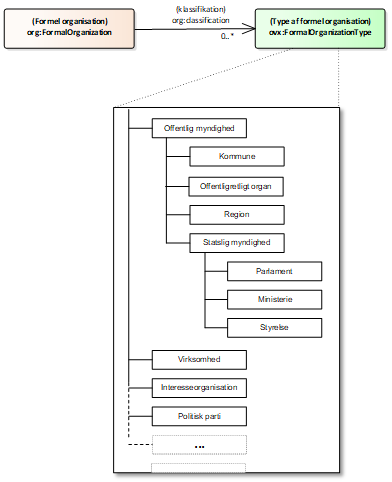
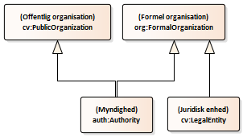
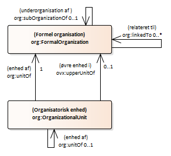

# Organisationen og den organisatoriske struktur

(indsæt billede)
 
Organisationer vil i de fleste tilfælde have en organisatorisk struktur, oftest en hierarkisk form. 

En organisation kan bestå af flere underorganisationer der hver for sig har en specifik identitet, fx kan et ministerium bestå af flere underordnede styrelser.

En organisation kan være inddelt i mindre organisationsenheder hvis eksistens er afhængig af organisationen, fx en afdeling i en større organisation. Organisationer består typisk af mange afdelinger, kontorer, enheder, teams, grupper osv. En organisationsenhed kan også have underordnede enheder.

Organisationer kan indbyrdes have andre former for relationer end de der udtrykkes i form af under- og overorganisatoriske forhold, fx finansiering eller kæderelationer.

En organisation kan klassificeres som værende af en bestemt organisationstype. I forhold til offentlige organisationer kunne det fx være kommune, region, ministerier, styrelser og mange af de andre former for offentlige organisationer, der er en væsentlig del af hverdagen i det offentlige organisationslandskab.

## Organisationen og dens dele
I den organisatoriske struktur indgår to helt centrale klasser:

Den klasse der repræsenterer organisationen som den helhed der normalt tænkes på når der refereres til organisationen. Klassen for <ins>den formelle organisation</ins>.

Den klasse der repræsentere afgrænsede dele af organisationen. Klassen for <ins>organisatoriske enheder</ins>.

### Formel organisation (klasse)
##### _Vokabular-definition og beskrivelser_

<table>
<tr>
    <td>URI</td>
    <td>http://www.w3.org/ns/org#FormalOrganization</td>
</tr>
<tr>
    <td>Term</td>
    <td>Formel organisation</td>
</tr>
 <tr>
    <td>Kommentar</td>
    <td>En organisation, der er anerkendt i verden bredt set, især i juridiske jurisdiktioner, med tilhørende rettigheder og ansvar. Eksempler inkluderer et selskab, velgørenhed, regering eller kirke.</td>
</tr>
  <tr>
    <td>Anvendelsesnote</td>
    <td>Bemærk, at dette er en superklasse af `gr:BusinessEntity`, og det anbefales at bruge GoodRelations-vikabularet til at betegne Business-klassifikationer såsom DUNS eller NAICS.</td>
</tr>
   <tr>
    <td>Underklasse  af</td>
    <td>foaf:Organization   org:Organization</td>
</tr>
</table>

##### _Profilens kontekstrestriktioner og annotationer_
(farve, der er farve i den følgende tabel)
<table>
<tr>
    <td>Alternativ term</td>
    <td>Organisation</td>
</tr>
 <tr>
    <td>Definition</td>
    <td> [Fra Informationsmodel]   En organisation, der er bredt anerkendt i omverdenen, med tilhørende rettigheder og ansvar</td>
</tr>
  <tr>
    <td>Eksempel</td>
    <td> [Fra Informationsmodel]   Organisationer kan ofte nedbrydes i hierarkiske strukturer  
Organisationen er "rammen" for alle de øvrige elementer (Organisationsenheder, Organisationsmedlemmer og deres indbyrdes relationer)  
Eksempel:  
o	et aktieselskab  
o	en statslig styrelse  
o	en velgørende forening  
o	en kirkelig forening  
- ....</td>
</tr>
</table>

### Organisatorisk enhed (klasse)
##### _Vokabular-definition og beskrivelser_
<table>
<tr>
    <td>URI</td>
    <td>http://www.w3.org/ns/org#OrganizationalUnit</td>
</tr>
 <tr>
    <td>Term</td>
    <td>Organisatorisk enhed</td>
</tr>
  <tr>
    <td>Kommentar</td>
    <td>En organisation, såsom en afdeling eller supportenhed, som er en del af en større organisation og kun har fuld anerkendelse inden for den pågældende organisations kontekst. Navnlig vil enheden ikke blive betragtet som en juridisk enhed i sig selv.</td>
</tr>
   <tr>
    <td>Anvendelsesnote</td>
    <td>Enheder kan være store og komplekse og indeholde andre enheder. Alternative navne: Afdeling</td>
</tr>
    <tr>
    <td>Underklasse af</td>
    <td>	foaf:Organization   org:Organization</td>
</tr>
</table>

##### _Profilens kontekstrestriktioner og annotationer_
<table>
<tr>
    <td>Alternativ term</td>
    <td>Afdeling</td>
</tr>
 <tr>
    <td>Definition</td>
    <td> [Fra informationsmodel]   en afdeling eller enhed i en organisation </td>
</tr>
  <tr>
    <td>Kommentar</td>
    <td> [Fra informationsmodel]   organisationsenheder kan være mere eller mindre permanente. Eksempelvis kan der oprettes en organisationsenhed til et projekt, hvorefter den opløses, når projektet er slut. Eller en organisationsenhed kan være en permanent del af organisationen, som f.eks. "bogholderiet". </td>
</tr>
   <tr>
    <td>Kommentar</td>
    <td> [Fra informationsmodel]   organisationsenheder kan være mere eller mindre permanente. Eksempelvis kan der oprettes en organisationsenhed til et projekt, hvorefter den opløses, når projektet er slut. Eller en organisationsenhed kan være en permanent del af organisationen, som f.eks. "bogholderiet".   Fælles for organisationsenheder er, at de har til formål at have noget at samle organisationsmedlemmer i og kan omtale som noget kendt i organisationen. </td>
</tr>
   <tr>
    <td>Eksempel</td>
    <td> [Fra informationsmodel]   o	Bogholderiet  
o	Projekt "ny organisationsstandard"  
o	Hæmatologisk afdeling  
- .... </td>
</tr>
</table>

### Typer af ’Formel organisation’ og ’Organisatorisk enhed’
Det foreslås i første udgave af basisprofilen at undlade inddragelse af klasser som ’Myndighed’ og ’Virksomhed’. Klassen ’Formel organisation’ har fået tilføjet en egenskab der peger på en klassifikation af organisationstyper, der blandt andet kan indeholde både ’Myndighed’ og ’Virksomhed’ og andre relevante typeangivelser, eksempelvis ’Region’, ’Kommune’ og ’Statslig styrelse’.

Fra ORG genanvendes org:classification til at angive typen af organisation.

Som indikeret i ovenstående illustration så benyttes egenskaben org:classification til at udpege en klassifikation hvis emner repræsenterer organisationstyper. De viste emner er udelukkende eksempler på mulige typer af oranisationer. Klassifikationen kan udvides løbende efter behov.

Senere udgaver af basisprofilen vil kunne indeholde de to nævnte klasser og andre relevante specialiseringer af ’Formel organisation’, hvis der er behov for det.

’Myndighed’ vil i det tilfælde kunne repræsenteres som en klasse der både er en delmængde af klassen ’Formel organisation’ og en delmængde af klassen [’Offentlig organisation’](https://semiceu.github.io/CPOV/releases/2.00/#Public%20Organisation ).
For ’Virksomhed’ vil klassen [’Juridisk enhed’](https://semiceu.github.io/Core-Business-Vocabulary/releases/2.00/#Legal%20Entity ) kunne anvendes.

På tilsvarende måde bruges org:classification til at angive typen af organisatorisk enhed.

I kapitlerne ’Den formelle organisations egenskaber’ og ’Den organisatoriske enheds egenskaber’ beskrives de to klasser der er anvendt til typeangivelse.

## Organisationens tilhørende enheder

#### enhed af
##### _Vokabular-definition og beskrivelser_
<table>
<tr>
    <td>URI</td>
    <td>http://www.w3.org/ns/org#unitOf</td>
</tr>
 <tr>
    <td>Term</td>
    <td>enhed af</td>
</tr>
  <tr>
    <td>Kommentar</td>
    <td>Angiver en organisation, som denne enhed er en del af, f.eks. en afdeling inden for en større formel organisation</td>
</tr>
   <tr>
    <td>Anvendelsesnote</td>
    <td>Dette er den inverse af org:hasUnit.</td>
</tr>
   <tr>
    <td>Domæne</td>
    <td>org:OrganizationalUnit</td>
</tr>
   <tr>
    <td>Udfaldsrum</td>
    <td>org:Organization</td>
</tr>
   <tr>
    <td>Underegenskab af</td>
    <td>org:subOrganizationOf</td>
</tr>
   <tr>
    <td>Underegenskab af</td>
    <td>org:subOrganizationOf</td>
</tr>
   <tr>
    <td>Underegenskab af</td>
    <td>org:subOrganizationOf</td>
</tr>
   <tr>
    <td>Modsatrettet egenskab</td>
    <td>org:hasUnit</td>
</tr> 
   <tr>
    <td>Profilens</td>
    <td>kontekstrestriktioner og annotationer</td>
</tr> 
   <tr>
    <td>Definition</td>
    <td>[fra informationsmodel]   organisationsenheder vil altid høre til netop en Organisation</td>
</tr> 
   <tr>
    <td>Kommentar</td>
    <td>Angiver en formel organisation, som denne organisatoriske enhed er en del af, f.eks. en afdeling inden for en større formel organisation</td>
</tr>
   <tr>
    <td>Kommentar</td>
    <td>[fra informationsmodel]   en organsation kan have mange organisatoriske enheder</td>
</tr>
   <tr>
    <td>Anvendelsesnote</td>
    <td>En organisatorisk enhed skal altid være tilknyttet en og kun en formel organisation.</td>
</tr>
   <tr>
    <td>Udfaldsrum</td>
    <td>org:FormalOrganization</td>
</tr>
   <tr>
    <td>Multiplicitet</td>
    <td>1 - 1</td>
</tr>
</table>

#### øvre enhed i
##### _Vokabular-definition og beskrivelser_
<table>
<tr>
    <td>URI</td>
    <td>https://data.gov.dk/model/core/organisation/extension/upperUnitOf</td>
</tr>
 <tr>
    <td>Term</td>
    <td>øvre enhed i</td>
</tr>
 <tr>
    <td>Alternativ term</td>
    <td>top enhed i</td>
</tr>
  <tr>
    <td>Definition</td>
    <td>Angiver den formelle organisation som en topenhed er en del af.</td>
</tr>
   <tr>
    <td>Domæne</td>
    <td>org:OrganizationalUnit</td>
</tr>
   <tr>
    <td>Udfaldsrum</td>
    <td>org:FormalOrganization</td>
</tr>
   <tr>
    <td>Underegenskab af</td>
    <td>org:uniOf</td>
</tr>
   <tr>
    <td>Modsatrettet egenskab</td>
    <td>ovx:hasUpperUnit</td>
</tr>
</table>
 	
_Profil-restriktioner og annotationer_
<table>
<tr>
    <td>Definition</td>
    <td>[fra informationsmodel]   markerer at denne orgaisationsenhed er den øverste i et hiererki.</td>
</tr>
   <tr>
    <td>Multiplicitet</td>
    <td>0 - 1</td>
</tr>
</table>

### Organisatoriske enheders indbyrdes hierarki
 
#### enhed af
##### _Vokabular-definition og beskrivelser_
<table>
<tr>
    <td>URI</td>
    <td>https://data.gov.dk/model/core/organisation/extension/upperUnitOf</td>
</tr>
 <tr>
    <td>Term</td>
    <td>øvre enhed i</td>
</tr>
 <tr>
    <td>Alternativ term</td>
    <td>top enhed i</td>
</tr>
  <tr>
    <td>Definition</td>
    <td>Angiver den formelle organisation som en topenhed er en del af.</td>
</tr>
   <tr>
    <td>Domæne</td>
    <td>org:OrganizationalUnit</td>
</tr>
   <tr>
    <td>Udfaldsrum</td>
    <td>org:FormalOrganization</td>
</tr>
   <tr>
    <td>Underegenskab af</td>
    <td>org:uniOf</td>
</tr>
   <tr>
    <td>Modsatrettet egenskab</td>
    <td>ovx:hasUpperUnit</td>
</tr>
</table>
 	
##### _Profil-restriktioner og annotationer_
<table>
<tr>
    <td>URI</td>
    <td>[http://www.w3.org/ns/org#unitOf](http://www.w3.org/ns/org#unitOf )</td>
</tr>
   <tr>
    <td>Term</td>
    <td>enhed af</td>
</tr>
   <tr>
    <td>Kommentar</td>
    <td>Angiver en organisation, som denne enhed er en del af, f.eks. en afdeling inden for en større formel organisation</td>
</tr>
   <tr>
    <td>Kommentar</td>
    <td>Angiver en organisation, som denne enhed er en del af, f.eks. en afdeling inden for en større formel organisation.</td>
</tr>
   <tr>
    <td>Anvendelsesnote</td>
    <td>Dette er den inverse egenskab af org:hasUnit.</td>
</tr>
   <tr>
    <td>Domæne</td>
    <td>org:OrganizationalUnit</td>
</tr>
   <tr>
    <td>Udfaldsrum</td>
    <td>org:Organization</td>
</tr>
   <tr>
    <td>Underegenskab af</td>
    <td>org:subOrganizationOf</td>
</tr>
   <tr>
    <td>Modsatrettet egenskab</td>
    <td>org:hasUnit</td>
</tr>
</table>
	
##### _Profilens kontekstrestriktioner og annotationer_
<table>
<tr>
    <td>Definition</td>
    <td>[fra informationsmodel]   en organisationsenhed kan være underlagt en anden organisationsenhed</td>
</tr>
 <tr>
    <td>Kommentar</td>
    <td>[fra informationsmodel]   en organisationsenhed kan indeholde 0 en eller flere enheder.</td>
</tr>
  <tr>
    <td>Anvendelsesnote</td>
    <td>Anvendes fra ’Organisatorisk enhed’ til at angive en enhed (i samme organisation) som den anvende enhed er organisatorisk underlagt.</td>
</tr>
   <tr>
    <td>Multiplicitet</td>
    <td>1 - 1</td>
</tr>
   <tr>
    <td>Multiplicitet</td>
    <td>1 - 1</td>
</tr>
</table>

## Organisationens relationer til andre organisationer

(billede)

#### underorganisation af
##### _Vokabular-definition og beskrivelser_
<table>
<tr>
    <td>URI</td>
    <td>http://www.w3.org/ns/org#subOrganizationOf</td>
</tr>
 <tr>
    <td>Term</td>
    <td>underorganisation af</td>
</tr>
  <tr>
    <td>Kommentar</td>
    <td>Repræsenterer hierarkisk indhold af organisationer eller organisationsenheder. Den angiver en organisation, som indeholder denne organisation.</td>
</tr>
  <tr>
    <td>Domæne</td>
    <td>org:Organization</td>
</tr>
  <tr>
    <td>Udfaldsrum</td>
    <td>org:Organization</td>
</tr>
  <tr>
    <td>Underegenskab af</td>
    <td>org:transitiveSubOrganizationOf</td>
</tr>
  <tr>
    <td>Modsatrettet egenskab</td>
    <td>org:hasSubOrganization</td>
</tr>
   <tr>
    <td>Modsatrettet egenskab</td>
    <td>org:hasSubOrganization</td>
</tr>
</table>
	
##### _Profilens kontekstrestriktioner og annotationer_
<table>
<tr>
    <td>Definition</td>
    <td>[fra informationsmodel]   en organisation kan indeholde andre organisationer</td>
</tr>
 <tr>
    <td>Kommentar</td>
    <td>[fra informationsmodel]   Digitaliseringsstyrelsen er en selvstændig juridisk organisation som er en del af Finansministeriet og deres organisation</td>
</tr>
  <tr>
    <td>Anvendelsesnote</td>
    <td>Bruges til at angive en hierarkisk overordnet organisation.</td>
</tr>
   <tr>
    <td>Domæne</td>
    <td>org:FomalOrganization</td>
</tr>
   <tr>
    <td>Udfaldsrum</td>
    <td>org:FomalOrganization</td>
</tr>
   <tr>
    <td>Multiplicitet</td>
    <td>0 - 1</td>
</tr>
</table>

#### relateret til
##### _Vokabular-definition og beskrivelser_
<table>
<tr>
    <td>URI</td>
    <td>http://www.w3.org/ns/org#linkedTo</td>
</tr>
 <tr>
    <td>Term</td>
    <td>relateret til</td>
</tr>
  <tr>
    <td>Kommentar</td>
    <td>Angiver en arbitrær relation mellem to organisationer</td>
</tr>
   <tr>
    <td>Anvendelsesnote</td>
    <td>Specialiseringer heraf kan bruges til fx at betegne finansiering eller forsyningskædeforhold.</td>
</tr>
   <tr>
    <td>Domæne</td>
    <td>org:Organization</td>
</tr>
   <tr>
    <td>Udfaldsrum</td>
    <td>org:Organization</td>
</tr>
</table>

##### _Profilens kontekstrestriktioner og annotationer_
<table>
<tr>
    <td>Anvendelsesnote</td>
    <td>Bruges til at angive en organisation som denne organisation har en eller anden relation til.</td>
</tr>
 <tr>
    <td>Domæne</td>
    <td>org:FomalOrganization</td>
</tr>
  <tr>
    <td>Udfaldsrum</td>
    <td>org:FomalOrganization</td>
</tr>
   <tr>
    <td>Multiplicitet</td>
    <td>0 - *</td>
</tr>
</table>
