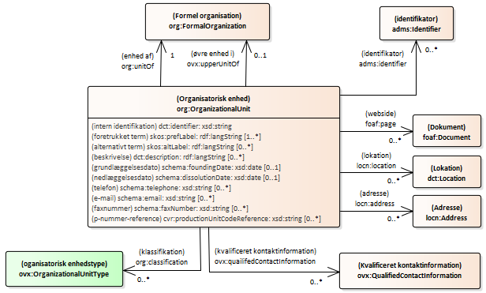
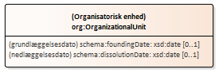
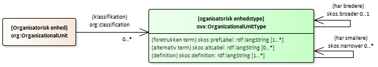

# Den organisatoriske enhed

 
## Den organisatoriske enheds identifikation og beskrivelse

(indsæt billede)
 
#### intern identifikation
##### _Vokabular-definition og beskrivelser_
<table>
    <tr>
        <td>URI</td>
        <td>http://purl.org/dc/terms/identifier</td>
    </tr>
    <tr>
        <td>Term</td>
        <td>identifikator</td>
    </tr>
    <tr>
        <td>Beskrivelse</td>
        <td>Anbefalet bedste praksis er at identificere ressourcen ved hjælp af en streng, der er i overensstemmelse med et formelt identifikationssystem.</td>
    </tr>
    <tr>
        <td>Kommentar</td>
        <td>En entydig reference til ressourcen inden for en given kontekst. Eksempler omfatter International Standard Book Number (ISBN), Digital Object Identifier (DOI) og Uniform Resource Name (URN). Stabile identifikatorer bør angives som HTTP-URI'er.</td>
    </tr>
    <tr>
        <td>Eksempel</td>
        <td>Eksempler omfatter International Standard Book Number (ISBN), Digital Object Identifier (DOI) og Uniform Resource Name (URN). Stabile identifikatorer bør angives som HTTP-URI'er.</td>
    </tr>
    <tr>
        <td>Domæne</td>
        <td>rdfs:Resource</td>
    </tr>
    <tr>
        <td>Udfaldsrum</td>
        <td>rdfs:Literal</td>
    </tr>
    <tr>
        <td>Definition</td>
        <td>[fra informationsmodel] Den centrale, brugervendte nøgle for organisationsenheden</td>
    </tr>
    <tr>
        <td>Kommentar</td>
        <td>[fra informationsmodel] anvendes eksempelvis i sundhedssektoren, hvor alle afdelinger er angivet efter et nummersystem. Den brugervendte nøgle kan skifte over tid, hvis er kommer nye nummer-/nøglesystemer.</td>
    </tr>
    <tr>
        <td>Domæne</td>
        <td>org:OrganizationalUnit</td>
    </tr>
    <tr>
        <td>Udfaldsrum</td>
        <td>xsd:string</td>
    </tr>
    <tr>
        <td>Multiplicitet</td>
        <td>1 - 1</td>
    </tr>
</table>

#### foretrukken betegnelse
##### _Vokabular-definition og beskrivelser_
<table>
    <tr>
        <td>URI</td>
        <td>http://www.w3.org/2004/02/skos/core#prefLabel</td>
    </tr>
    <tr>
        <td>Term</td>
        <td>foretrukken term</td>
    </tr>
    <tr>
        <td>Definition</td>
        <td>Den foretrukne leksikalske betegnelse for en ressource på et givet sprog.</td>
    </tr>
    <tr>
        <td>Kommentar</td>
        <td>En ressource har ikke mere end én værdi af skos:prefLabel pr. sprogtag. Range for skos:prefLabel er klassen af RDF ’plain literals’. skos:prefLabel, skos:altLabel, og skos:hiddenLabel er parvis disjunkte egenskaber.</td>
    </tr>
    <tr>
        <td>Domæne</td>
        <td>rdfs:Resource</td>
    </tr>
    <tr>
        <td>Udfaldsrum</td>
        <td>xsd:string eller rdf:langString (tidligere angivet som rdf:PlainLiteral)</td>
    </tr>
    <tr>
        <td>Underegenskab af</td>
        <td>rdfs:label</td>
    </tr>
</table>

##### _Profilens kontekstrestriktioner og annotationer_ 
<table>
    <tr>
        <td>Alternativ term</td>
        <td>afdelingsnavn</td>
    </tr>
    <tr>
        <td>Definition</td>
        <td>alment anvendt navn for en organisationsenhed</td>
    </tr>
    <tr>
        <td>Kommentar</td>
        <td>Organisationsenheders navn tildeles af organisationen</td>
    </tr>
    <tr>
        <td>Anvendelsesnote</td>
        <td>Bruges til at angive den organisatoriske enheds primære navn.</td>
    </tr>
    <tr>
        <td>Eksempel</td>
        <td>
            <ul>
                <li>"Bogholderiet"</li>
                <li>Projekt "ny organisationsstandard"</li>
                <li>"Hæmatologisk afdeling"</li>
                <li>...</li>
            </ul>
        </td>
    </tr>
    <tr>
        <td>Domæne</td>
        <td>org:OrganizationalUnit</td>
    </tr>
    <tr>
        <td>Udfaldsrum</td>
        <td>rdf:langString</td>
    </tr>
    <tr>
        <td>Multiplicitet</td>
        <td>1 - *</td>
    </tr>
</table>

#### alternativ betegnelse
##### _Vokabular-definition og beskrivelser_
<table>
    <tr>
        <td>URI</td>
        <td>http://www.w3.org/2004/02/skos/core#altLabel</td>
    </tr>
    <tr>
        <td>Foretrukken term</td>
        <td>alternativ term</td>
    </tr>
    <tr>
        <td>Definition</td>
        <td>En alternativ leksikalsk term for en ressource.</td>
    </tr>
    <tr>
        <td>Kommentar</td>
        <td>Range for skos:altLabel er klassen af RDF 'plain literals'. skos:prefLabel, skos:altLabel, og skos:hiddenLabel er parvis disjunkte egenskaber.</td>
    </tr>
    <tr>
        <td>Eksempel</td>
        <td>Akronymer, forkortelser, stavevarianter og uregelmæssige flertals-/entalsformer kan inkluderes blandt de alternative betegnelser for et begreb. Fejlstavede termer er normalt inkluderet som skjulte etiketter (se skos:hiddenLabel).</td>
    </tr>
    <tr>
        <td>Domæne</td>
        <td>rdfs:Resource</td>
    </tr>
    <tr>
        <td>Udfaldsrum</td>
        <td>xsd:string eller rdf:langString (tidligere angivet som rdf:PlainLiteral)</td>
    </tr>
    <tr>
        <td>Underegenskab af</td>
        <td>rdfs:label</td>
    </tr>
</table>

##### _Profilens kontekstrestriktioner og annotationer_ 
<table>
    <tr>
        <td>Definition</td>
        <td>et andet navn for organisationsenheden end det alment foretrukne</td>
    </tr>
    <tr>
        <td>Kommentar</td>
        <td>Ofte opstår der alment kendte forkortelser eller alternative navne for organisationsenheder - især hvis det officielle navn er meget langt eller ikke så mundret.</td>
    </tr>
    <tr>
        <td>Anvendelsesnote</td>
        <td>Bruges til at angive et accepteret - men ikke foretrukket - navn for den organisatoriske enhed.</td>
    </tr>
    <tr>
        <td>Eksempel</td>
        <td>
            <ul>
                <li>navn: "Digitalisering og Arkitektur"</li>
                <li>alternativt navn: "DIA"</li>
                <li>navn: EKSEMPEL SØGES</li>
            </ul>
        </td>
    </tr>
    <tr>
        <td>Udfaldsrum</td>
        <td>rdf:langString</td>
    </tr>
    <tr>
        <td>Multiplicitet</td>
        <td>0 - *</td>
    </tr>
</table>

#### p-nummer-reference
Et ’p-nummer’ identificerer et sted, en lokation hvor en virksomhed har aktivitet. Ofte ses et p-nummer dog tilknyttet direkte til en instans af ’Formel organisation’ eller ’Organisatorisk enhed’, hvilket formelt set ikke er korrekt. For at håndtere denne brug er egenskaben ’p-nummer-reference’ dannet.
##### _Vokabular-definition og beskrivelser_
<table>
    <tr>
        <td>URI</td>
        <td>https://data.gov.dk/model/core/registered-business/productionUnitCodeReference</td>
    </tr>
    <tr>
        <td>Term</td>
        <td>p-nummer-reference</td>
    </tr>
    <tr>
        <td>Definition</td>
        <td>En repræsentation af et produktionsenhedsnummer, anvendt som reference til produktionsenheden</td>
    </tr>
    <tr>
        <td>Domæne</td>
        <td>rdfs:Resource</td>
    </tr>
    <tr>
        <td>Udfaldsrum</td>
        <td>xsd:string</td>
    </tr>
</table>

##### _Profilens kontekstrestriktioner og annotationer_
<table>
    <tr>
        <td>Domæne</td>
        <td>org:OrganizationalUnit</td>
    </tr>
    <tr>
        <td>Udfaldsrum</td>
        <td>xsd:string</td>
    </tr>
    <tr>
        <td>Multiplicitet</td>
        <td>0 - *</td>
    </tr>
</table>

## Historik for den organisatoriske enhed

#### oprettelsesdato
##### _Vokabular-definition og beskrivelser_
<table>
    <tr>
        <td>URI</td>
        <td>http://schema.org/foundingDate</td>
    </tr>
    <tr>
        <td>Term</td>
        <td>grundlæggelsesdato</td>
    </tr>
    <tr>
        <td>Alternativ term</td>
        <td>oprettelsesdato</td>
    </tr>
    <tr>
        <td>Kommentar</td>
        <td>den dato organisationen blev oprettet</td>
    </tr>
    <tr>
        <td>Domæne</td>
        <td>schema:Organization</td>
    </tr>
    <tr>
        <td>Udfaldsrum</td>
        <td>schema:Date</td>
    </tr>
</table>

##### _Profil-restriktioner og annotationer_ 
<table>
    <tr>
        <td>Definition</td>
        <td>den dato organisationsenheden blev oprettet</td>
    </tr>
    <tr>
        <td>Anvendelsesnote</td>
        <td>I schema.org anvendes termen ’organisation’ bredt og dækker også over ’organisatorisk enhed’. Anvendt i denne sammenhæng angiver egenskaben den dato hvorpå den organisatoriske enhed blev oprettet.</td>
    </tr>
    <tr>
        <td>Domæne</td>
        <td>org:OrganizationalUnit</td>
    </tr>
    <tr>
        <td>Udfaldsrum</td>
        <td>xsd:date</td>
    </tr>
    <tr>
        <td>Multiplicitet</td>
        <td>0 - 1</td>
    </tr>
</table>

#### nedlæggelsesdato
##### _Vokabular-definition og beskrivelser_
<table>
    <tr>
        <td>URI</td>
        <td>http://schema.org/dissolutionDate</td>
    </tr>
    <tr>
        <td>Term</td>
        <td>nedlæggelsesdato</td>
    </tr>
    <tr>
        <td>Kommentar</td>
        <td>den dato organisationen blev nedlagt</td>
    </tr>
    <tr>
        <td>Domæne</td>
        <td>schema:Organization</td>
    </tr>
    <tr>
        <td>Udfaldsrum</td>
        <td>schema:Date</td>
    </tr>
</table>

##### _Profil-restriktioner og annotationer _
<table>
    <tr>
        <td>Alternativ term</td>
        <td>opløsningsdato</td>
    </tr>
    <tr>
        <td>Definition</td>
        <td>Den dato organisationsenheden bliver nedlagt</td>
    </tr>
    <tr>
        <td>Kommentar</td>
        <td>nedlæggelsesdatoen skal være lig med eller senere end oprettelsesdatoen</td>
    </tr>
    <tr>
        <td>Anvendelsesnote</td>
        <td>I schema.org anvendes termen ’organisation’ bredt og dækker også over ’organisatorisk enhed’. Anvendt i denne sammenhæng angiver den dato hvorpå den organisatoriske enhed blev nedlagt.</td>
    </tr>
    <tr>
        <td>Domæne</td>
        <td>org:OrganizationalUnit</td>
    </tr>
    <tr>
        <td>Udfaldsrum</td>
        <td>xsd:date</td>
    </tr>
    <tr>
        <td>Multiplicitet</td>
        <td>0 - 1</td>
    </tr>
</table>

## Typer af organisatoriske enheder

<table>
    <tr>
        <td>URI</td>
        <td>http://www.w3.org/ns/org#classification</td>
    </tr>
    <tr>
        <td>Term</td>
        <td>klassifikation</td>
    </tr>
    <tr>
        <td>Kommentar</td>
        <td>Angiver en klassifikation for denne Organisation inden for et klassifikationsskema. Udvidelsesvokabularer ønsker måske at specialisere denne egenskab til at have et område svarende til et specifikt 'skos:ConceptScheme'. Denne egenskab er under diskussion og kan blive revideret eller fjernet - i mange tilfælde kategoriseres organisationer bedst ved at definere et underklassehierarki i et udvidelsesordforråd.</td>
    </tr>
    <tr>
        <td>Domæne</td>
        <td>org:Organization</td>
    </tr>
    <tr>
        <td>Udfaldsrum</td>
        <td>skos:Concept</td>
    </tr>
</table>

##### _Profil-restriktioner og annotationer_
<table>
    <tr>
        <td>Definition</td>
        <td>Angiver en klassifikation for denne [organisatoriske enhed] inden for et eller andet klassifikationssystem.</td>
    </tr>
    <tr>
        <td>Definition [fra informationsmodel]</td>
        <td>Beskriver den slags organisationsenhed der er tale om.</td>
    </tr>
    <tr>
        <td>Kommentar [fra informationsmodel]</td>
        <td>Kan anvendes til at imødekomme forskellige forretningsregler, som retter sig mod typen af Organisationsenhed.</td>
    </tr>
    <tr>
        <td>Eksempel [fra informationsmodel]</td>
        <td>
            <ul>
                <li>klinisk-administrativt niveau</li>
                <li>økonomi</li>
                <li>...</li>
            </ul>
        </td>
    </tr>
    <tr>
        <td>Domæne</td>
        <td>org:OrganizationalUnit</td>
    </tr>
    <tr>
        <td>Udfaldsrum</td>
        <td>ovx:OrganizationalUnitType</td>
    </tr>
    <tr>
        <td>Multiplicitet</td>
        <td>0 - *</td>
    </tr>
</table>

### Organisatorisk enhedstype (klasse)
##### _Vokabular-definition og beskrivelser_
URI	https://data.gov.dk/model/core/organisation/extension/-OrganizationalUnitType
Term	Organisatoriske enhedstype
Definition	Klassifikation af organisationstyper.
Eksempel	Typer af organisatoriske enheder:
Afdeling
Kontor
Team
Underklasse af	skos:Concept
##### _Profilens kontekstrestriktioner og annotationer_

#### foretrukken term
##### _Vokabular-definition og beskrivelser_
<table>
    <tr>
        <td>URI</td>
        <td>http://www.w3.org/2004/02/skos/core#prefLabel</td>
    </tr>
    <tr>
        <td>Term</td>
        <td>foretrukken term</td>
    </tr>
    <tr>
        <td>Definition</td>
        <td>Den foretrukne leksikalske betegnelse for en ressource på et givet sprog.</td>
    </tr>
    <tr>
        <td>Kommentar</td>
        <td>En ressource har ikke mere end én værdi af skos:prefLabel pr. sprogtag. Range for skos:prefLabel er klassen af RDF ’plain literals’. skos:prefLabel, skos:altLabel og skos:hiddenLabel er parvis disjunkte egenskaber.</td>
    </tr>
    <tr>
        <td>Domæne</td>
        <td>rdfs:Resource</td>
    </tr>
    <tr>
        <td>Udfaldsrum</td>
        <td>xsd:string eller rdf:langString (tidligere angivet som rdf:PlainLiteral)</td>
    </tr>
    <tr>
        <td>Underegenskab af</td>
        <td>rdfs:label</td>
    </tr>
</table>

##### _Profilens kontekstrestriktioner og annotationer_ 
<table>
    <tr>
        <td>Anvendelsesnote</td>
        <td>Bruges til at angive den organisatoriske enheds foretrukne navn. Det antages at organisationer selv er ophav til enhedens navn. Navnet kan angives på flere sprog og dermed give flere forekomster af egenskaben skos:prefLabel for den enkelte organisation.</td>
    </tr>
    <tr>
        <td>Udfaldsrum</td>
        <td>rdf:langString</td>
    </tr>
    <tr>
        <td>Multiplicitet</td>
        <td>1 - *</td>
    </tr>
</table>

#### alternativ term
##### _Vokabular-definition og beskrivelser_
<table>
    <tr>
        <td>URI</td>
        <td>http://www.w3.org/2004/02/skos/core#altLabel</td>
    </tr>
    <tr>
        <td>Foretrukken term</td>
        <td>alternativ term</td>
    </tr>
    <tr>
        <td>Definition</td>
        <td>En alternativ leksikalsk term for en ressource.</td>
    </tr>
    <tr>
        <td>Kommentar</td>
        <td>Range for skos:altLabel er klassen af RDF ’plain literals’. skos:prefLabel, skos:altLabel og skos:hiddenLabel er parvis disjunkte egenskaber. Akronymer, forkortelser, stavevarianter og uregelmæssige flertals-/entalsformer kan inkluderes blandt de alternative betegnelser for et begreb. Fejlstavede termer er normalt inkluderet som skjulte etiketter (se skos:hiddenLabel).</td>
    </tr>
    <tr>
        <td>Eksempel</td>
        <td>Akronymer, forkortelser, stavevarianter og uregelmæssige flertals-/entalsformer</td>
    </tr>
    <tr>
        <td>Domæne</td>
        <td>rdfs:Resource</td>
    </tr>
    <tr>
        <td>Udfaldsrum</td>
        <td>xsd:string eller rdf:langString (tidligere angivet som rdf:PlainLiteral)</td>
    </tr>
    <tr>
        <td>Underegenskab af</td>
        <td>rdfs:label</td>
    </tr>
</table>

##### _Profilens kontekstrestriktioner og annotationer_ 
<table>
    <tr>
        <td>Anvendelsesnote</td>
        <td>Bruges til at angive et accepteret - men ikke foretrukkent - navn for den organisatoriske enhed.</td>
    </tr>
    <tr>
        <td>Udfaldsrum</td>
        <td>rdf:langString</td>
    </tr>
    <tr>
        <td>Multiplicitet</td>
        <td>0 - *</td>
    </tr>
</table>

#### definition
##### _Vokabular-definition og beskrivelser_
<table>
    <tr>
        <td>URI</td>
        <td>http://www.w3.org/2004/02/skos/core#definition</td>
    </tr>
    <tr>
        <td>Term</td>
        <td>definition</td>
    </tr>
    <tr>
        <td>Definition</td>
        <td>En erklæring eller formel forklaring af betydningen af et begreb.</td>
    </tr>
    <tr>
        <td>Domæne</td>
        <td>rdfs:Resource</td>
    </tr>
    <tr>
        <td>Udfaldsrum</td>
        <td>rdfs:Resource</td>
    </tr>
    <tr>
        <td>Underegenskab af</td>
        <td>skos:note</td>
    </tr>
</table>

##### _Profilens kontekstrestriktioner og annotationer_ 
Domæne	ovx:OrganizationalUnitType
Udfaldsrum	rdf:langString
Multiplicitet	0 - *

#### har bredere
<table>
    <tr>
        <td>URI</td>
        <td>http://www.w3.org/2004/02/skos/core#broader</td>
    </tr>
    <tr>
        <td>Term</td>
        <td>har bredere</td>
    </tr>
    <tr>
        <td>Definition</td>
        <td>Relaterer et begreb til et begreb, der har en mere generel betydning</td>
    </tr>
    <tr>
        <td>Kommentar</td>
        <td>Efter konvention bruges skos:broader kun til at erklære en umiddelbar (dvs. direkte) hierarkisk forbindelse mellem to konceptuelle ressourcer.</td>
    </tr>
    <tr>
        <td>Domæne</td>
        <td>rdfs:Resource</td>
    </tr>
    <tr>
        <td>Udfaldsrum</td>
        <td>rdfs:Resource</td>
    </tr>
    <tr>
        <td>Underegenskab af</td>
        <td>skos:broaderTransitive</td>
    </tr>
    <tr>
        <td>Modsatrettet egenskab</td>
        <td>skos:narrower</td>
    </tr>
</table>

##### _Profilens kontekstrestriktioner og annotationer_ 
<table>
    <tr>
        <td>Domæne</td>
        <td>ovx:OrganizationalUnitType</td>
    </tr>
    <tr>
        <td>Udfaldsrum</td>
        <td>ovx:OrganizationalUnitType</td>
    </tr>
    <tr>
        <td>Multiplicitet</td>
        <td>0 - 1</td>
    </tr>
</table>

#### har smallere
<table>
    <tr>
        <td>URI</td>
        <td>http://www.w3.org/2004/02/skos/core#narrower</td>
    </tr>
    <tr>
        <td>Term</td>
        <td>har smallere</td>
    </tr>
    <tr>
        <td>Definition</td>
        <td>Relaterer et begreb til et begreb, der er mere specifikt i betydning</td>
    </tr>
    <tr>
        <td>Domæne</td>
        <td>rdfs:Resource</td>
    </tr>
    <tr>
        <td>Udfaldsrum</td>
        <td>rdfs:Resource</td>
    </tr>
    <tr>
        <td>Underegenskab af</td>
        <td>skos:narrowerTransitive</td>
    </tr>
    <tr>
        <td>Modsatrettet egenskab</td>
        <td>skos:broader</td>
    </tr>
</table>

##### _Profilens kontekstrestriktioner og annotationer_ 
<table>
    <tr>
        <td>Domæne</td>
        <td>ovx:OrganizationalUnitType</td>
    </tr>
    <tr>
        <td>Udfaldsrum</td>
        <td>ovx:OrganizationalUnitType</td>
    </tr>
    <tr>
        <td>Multiplicitet</td>
        <td>0 - *</td>
    </tr>
</table>
