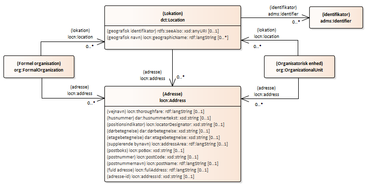

# Lokation og adresse

## Lokationen
Med anvendelsesprofilen kan en organisations fysiske placering angives enten direkte med en adresse eller via angivelse af et sted hvor organisationen holder til. Det sted organisationen holder til kan også tilføjes en adresse. 

Fra vokabularet Location Core Vocabulary anvendes egenskaben locn:address til at angive en direkte forbindelse mellem organisationen og en adresse. Fra samme vokabular anvendes også klassen locn:Address, der er defineret for at være kompatibel med INSPIREs krav til adresser.

En organisation og en organisationsenheds fysiske placering kan angives. En organisation kan også have flere forskellige fysiske placeringer.
Placeringen kan fx angives med en adresse.

(indsæt billede)

#### lokation
##### _Vokabular-definition og beskrivelser_
<table>
  <tr>
    <td>URI</td>
    <td>http://www.w3.org/ns/locn#location</td>
  </tr>
  <tr>
    <td>Term</td>
    <td>lokation</td>
  </tr>
  <tr>
    <td>Beskrivelse</td>
    <td>Knytter en ressource til den tilsvarende placering.</td>
  </tr>
  <tr>
    <td>Anvendelsesnote</td>
    <td>At erklære placeringsforholdet indebærer kun, at domænet har en eller anden forbindelse til en placering i tid eller rum. Det betyder ikke, at ressourcen nødvendigvis er på det sted på det tidspunkt, hvor påstanden fremsættes.</td>
  </tr>
  <tr>
    <td>Domæne</td>
    <td>rdfs:Resource</td>
  </tr>
  <tr>
    <td>Udfaldsrum</td>
    <td>dct:Location</td>
  </tr>
</table>

##### _Profil-restriktioner og annotationer_ 
<table>
  <tr>
    <td>Definition</td>
    <td>[fra informationsmodel (klassen Organisation)] beskriver hvor en organisation er beliggende</td>
  </tr>
  <tr>
    <td>Definition</td>
    <td>[fra informationsmodel (klassen Organisationsenhed)] beskriver hvor en organisationsenhed er beliggende</td>
  </tr>
  <tr>
    <td>Kommentar</td>
    <td>[fra informationsmodel (klassen Organisation)] Det kan både være et fysisk og et virtuelt sted. Denne relation kan evt. baseres på CVR's adresserelation, hvis organisationen beskriver en virksomheds organisationsstruktur.</td>
  </tr>
  <tr>
    <td>Kommentar</td>
    <td>[fra informationsmodel (klassen Organisationsenhed)] Det kan både være et fysisk og et virtuelt sted.</td>
  </tr>
  <tr>
    <td>Domæne</td>
    <td>org:FormalOrganization eller org:OrganizationalUnit</td>
  </tr>
  <tr>
    <td>Udfaldsrum</td>
    <td>dct:Location</td>
  </tr>
  <tr>
    <td>Multiplicitet</td>
    <td>0 - *</td>
  </tr>
</table>

### Lokation (klasse)
##### _Vokabular-definition og beskrivelser_
<table>
  <tr>
    <td>URI</td>
    <td>http://purl.org/dc/terms/Location</td>
  </tr>
  <tr>
    <td>Term</td>
    <td>Lokation</td>
  </tr>
  <tr>
    <td>Kommentar</td>
    <td>Et spatialt område eller navngivet sted.</td>
  </tr>
  <tr>
    <td>Underklasse af</td>
    <td>dct:LocationPeriodOrJurisdiction</td>
  </tr>
</table>

##### _Profilens kontekstrestriktioner og annotationer_ 
<table>
  <tr>
    <td>Definition</td>
    <td>[fra informationsmodel (klassen Sted)] en fysisk eller virtuel lokation, hvor organisationen kan kontaktes</td>
  </tr>
  <tr>
    <td>Kommentar</td>
    <td>Dette er nøgleklassen for ISA Program Location Core Vocabulary og repræsenterer enhver placering, uanset størrelse eller anden begrænsning.</td>
  </tr>
</table>

#### geografisk identifikator
##### _Vokabular-definition og beskrivelser_
<table>
  <tr>
    <td>URI</td>
    <td>http://www.w3.org/2000/01/rdf-schema#seeAlso</td>
  </tr>
  <tr>
    <td>Term</td>
    <td>se også</td>
  </tr>
  <tr>
    <td>Kommentar</td>
    <td>Yderligere information om subjektressourcen.</td>
  </tr>
  <tr>
    <td>Domæne</td>
    <td>rdfs:Resource</td>
  </tr>
  <tr>
    <td>Udfaldsrum</td>
    <td>rdfs:Resource</td>
  </tr>
</table>

##### _Profil-restriktioner og annotationer_ 
<table>
  <tr>
    <td>Term</td>
    <td>geografisk identifikator</td>
  </tr>
  <tr>
    <td>Anvendelsesnote</td>
    <td>GeoNames.org leverer stabile, bredt anerkendte identifikatorer for mere end 10 millioner geografiske navne, der kan bruges som links til yderligere information. For eksempel identificerer <a href="http://sws.geonames.org/593116/">http://sws.geonames.org/593116/</a> den litauiske hovedstad Vilnius. Desværre kan disse URI'er ikke let udledes automatisk, da URI-skemaet bruger simple numeriske koder. At finde en GeoNames identifikator for en placering er næsten altid en manuel proces. Hvor sådanne identifikatorer er kendte eller kan findes, anbefales det dog, at de bruges. Hvor Location Class bruges til at identificere et land, hvis geonavnene URI ikke er kendt, anbefales det at bruge DBpedia URI'er i formen <a href="http://dbpedia.org/resource/ISO_3166-1:XX">http://dbpedia.org/resource/ISO_3166-1:XX</a> hvor XX er ISO 3166 to tegn kode for landet. EU's Publikationskontor afviger fra ISO 3166-1 og bruger EL og UK for henholdsvis Grækenland og Storbritannien. DBpedia holder sig til ISO-koderne, og derfor er de korrekte URI'er for disse lande: - <a href="http://dbpedia.org/resource/ISO_3166-1:GR">http://dbpedia.org/resource/ISO_3166-1:GR</a> - <a href="http://dbpedia.org/resource/ISO_3166-1:GB">http://dbpedia.org/resource/ISO_3166-1:GB</a> selv når det geografiske navn er angivet som EL eller UK.</td>
  </tr>
  <tr>
    <td>Domæne</td>
    <td>dct:Location</td>
  </tr>
  <tr>
    <td>Udfaldsrum</td>
    <td>xsd:anyURI</td>
  </tr>
  <tr>
    <td>Multiplicitet</td>
    <td>0 - 1</td>
  </tr>
</table>

#### geografisk navn
<table>
  <tr>
    <td>URI</td>
    <td>http://www.w3.org/ns/locn#geographicName</td>
  </tr>
  <tr>
    <td>Betegnelse (EN)</td>
    <td>geographic name</td>
  </tr>
  <tr>
    <td>Definition (EN)</td>
    <td>A textual description for a Location.</td>
  </tr>
  <tr>
    <td>Anvendelsesnote (EN)</td>
    <td>The INSPIRE Data Specification on Geographical Names provides a detailed model for describing a 'named place', including methods for providing multiple names in multiple scripts. INSPIRE's definition is the following: Names of areas, regions, localities, cities, suburbs, towns or settlements, or any geographical or topographical feature of public or historical interest. This is beyond what is necessary for the Core Location Vocabulary but, importantly, the concept of a geographic name used here is consistent.  A geographic name is a proper noun applied to a spatial object. Taking the example used in the INSPIRE document (page 18), the following are all valid geographic names for the Greek capital: - "Aθnνa"@gr-Grek (the Greek endonym written in the Greek script) - "Athína"@gr-Latn (the standard Romanisation of the endonym) - "Athens"@en (the English language exonym)  INSPIRE has a detailed (XML-based) method of providing metadata about a geographic name and in XML-data sets that may be the most appropriate method to follow. When using the Core Location Vocabulary in data sets that are not focussed on environmental/geographical data (the use case for INSPIRE), the Code datatype or a simple language identifier may be used to provide such metadata.  The country codes defined in ISO 3166 may be used as geographic names and these are generally preferred over either the long form or short form of a country's name (as they are less error prone). The Publications Office of the European Union recommends the use of ISO 3166-1 codes for countries in all cases except two: - use 'UK' in preference to the ISO 3166 code GB for the United Kingdom; - use 'EL' in preference to the ISO 3166 code GR for Greece. Where a country has changed its name or no longer exists (such as Czechoslovakia, Yugoslavia etc.) use the ISO 3166-3 code.</td>
  </tr>
  <tr>
    <td>Udfaldsrum</td>
    <td>rdf:langString</td>
  </tr>
  <tr>
    <td>Multiplicitet</td>
    <td>0 - *</td>
  </tr>
</table>

##### _Vokabular-definition og beskrivelser_
<table>
  <tr>
    <td>URI</td>
    <td>http://www.w3.org/ns/locn#geographicName</td>
  </tr>
  <tr>
    <td>Term</td>
    <td>geografisk navn</td>
  </tr>
  <tr>
    <td>Beskrivelse</td>
    <td>En tekstbeskrivelse for en placering.</td>
  </tr>
  <tr>
    <td>Anvendelsesnote</td>
    <td>INSPIRE-dataspecifikationen om geografiske navne giver en detaljeret model til at beskrive et 'navngivet sted', herunder metoder til at angive flere navne i flere scripts. INSPIREs definition er følgende: Navne på områder, regioner, lokaliteter, byer, forstæder, byer eller bygder eller ethvert geografisk eller topografisk træk af offentlig eller historisk interesse. Dette er ud over, hvad der er nødvendigt for Core Location Vocabulary, men vigtigst af alt er konceptet med et geografisk navn, der bruges her, konsekvent.  Et geografisk navn er et egennavn anvendt på et rumligt objekt. Med eksemplet brugt i INSPIRE-dokumentet (side 18), er følgende alle gyldige geografiske navne for den græske hovedstad: - "Aθnνa"@gr-Grek (det græske endonym skrevet i den græske skrift) - "Athína"@gr- Latn (standardromaniseringen af endonymet) - "Athens"@en (det engelsksprogede eksonym) INSPIRE har en detaljeret (XML-baseret) metode til at levere metadata om et geografisk navn og i XML-datasæt, der kan være den mest passende metode at følge. Når du bruger Core Location Vocabulary i datasæt, der ikke er fokuseret på miljømæssige/geografiske data (brugssagen for INSPIRE), kan kodedatatypen eller en simpel sprogidentifikator bruges til at levere sådanne metadata.  Landekoderne defineret i ISO 3166 kan bruges som geografiske navne, og disse foretrækkes generelt frem for enten den lange form eller den korte form af et lands navn (da de er mindre fejltilbøjelige). Den Europæiske Unions Publikationskontor anbefaler brugen af ISO 3166-1-koder for lande i alle tilfælde undtagen to: - Brug 'UK' frem for ISO 3166-koden GB for Det Forenede Kongerige; - Brug "EL" frem for ISO 3166-koden GR for Grækenland. Hvis et land har skiftet navn eller ikke længere eksisterer (såsom Tjekkoslovakiet, Jugoslavien osv.), skal du bruge ISO 3166-3-koden.</td>
  </tr>
  <tr>
    <td>Domæne</td>
    <td>dct:Location</td>
  </tr>
  <tr>
    <td>Udfaldsrum</td>
    <td>rdf:langString</td>
  </tr>
</table>

##### _Profil-restriktioner og annotationer_ 
<table>
  <tr>
    <td>Domæne</td>
    <td>dct:Location</td>
  </tr>
  <tr>
    <td>Udfaldsrum</td>
    <td>rdf:langString</td>
  </tr>
  <tr>
    <td>Multiplicitet</td>
    <td>0 - *</td>
  </tr>
</table>

#### p-nummer
##### _Vokabular-definition og beskrivelser_
<table>
  <tr>
    <td>URI</td>
    <td>https://data.gov.dk/model/core/registered-business/productionUnitCode</td>
  </tr>
  <tr>
    <td>Term</td>
    <td>p-nummer</td>
  </tr>
  <tr>
    <td>Definition</td>
    <td>Et entydigt identifikationsnummer for en lokation hvor en juridisk enhed har aktivitet.</td>
  </tr>
  <tr>
    <td>Ækvivalent egenskab</td>
    <td></td>
  </tr>
</table>

##### _Profil-restriktioner og annotationer_ 
<table>
  <tr>
    <td>Udfaldsrum</td>
    <td>xsd:string</td>
  </tr>
  <tr>
    <td>Multiplicitet</td>
    <td>0 - *</td>
  </tr>
</table>

## Adressen

(indsæt billede)

#### adresse
##### _Vokabular-definition og beskrivelser_
<table>
  <tr>
    <td>URI</td>
    <td>http://w3.org/ns/locn#address</td>
  </tr>
  <tr>
    <td>Term</td>
    <td>adresse</td>
  </tr>
  <tr>
    <td>Definition</td>
    <td>Knytter en ressource til den tilsvarende adresse.</td>
  </tr>
  <tr>
    <td>Anvendelsesnote</td>
    <td>At erklære adresseforholdet indebærer, at ressourcen har en adresse</td>
  </tr>
  <tr>
    <td>Domæne</td>
    <td>rdfs:Resource</td>
  </tr>
  <tr>
    <td>Udfaldsrum</td>
    <td>locn:Address</td>
  </tr>
</table>

##### _Profil-restriktioner og annotationer_
<table>
  <tr>
    <td>Kommentar</td>
    <td>Noter at det vil være muligt at definerer specialiseringer af locn:address til specifikke adressetyper, eksempelvis ’besøgsadresse’, ’postadresse’, aktivitetsadresse og andre der findes behov for.</td>
  </tr>
  <tr>
    <td>Domæne</td>
    <td>org:FormalOrganization  eller  org:OrganizationalUnit  eller  dct:Location</td>
  </tr>
  <tr>
    <td>Udfaldsrum</td>
    <td>locn:Address</td>
  </tr>
  <tr>
    <td>Multiplicitet</td>
    <td>0 - *</td>
  </tr>
</table>

### Adresse (klasse)
##### _Vokabular-definition og beskrivelser_
<table>
  <tr>
    <td>Definition</td>
    <td>Et spatialt objekt, der på en menneskelig læsbar måde identificerer en fast placering.</td>
  </tr>
  <tr>
    <td>Anvendelsesnote</td>
    <td>En "adresserepræsentation" som konceptuelt defineret af INSPIRE-adresserepræsentationens datatype: "Repræsentation af et geografisk adresseobjekt til brug i eksterne applikationsskemaer, der skal inkludere den grundlæggende adresseinformation på en læsbar måde.".
Repræsentationen af adresser varierer meget fra det ene lands postsystem til det andet. Selv inden for lande er der næsten altid eksempler på adresser, der ikke er i overensstemmelse med den angivne nationale standard. ISO 19160-1 giver dog en metode, hvorigennem forskellige adresser kan konverteres fra en konceptuel model til en anden.
Denne specifikation var stærkt baseret på INSPIRE-adresserepræsentationens datatype. Det er bemærkelsesværdigt, at hvis en adresse er angivet ved hjælp af den detaljerede opdeling foreslået af egenskaberne for denne klasse, så vil den være INSPIRE-konform. Til dette meget granulerede sæt af egenskaber tilføjer vi yderligere to egenskaber:
- fuld adresse (den komplette adresse som en formateret streng)
- addressID (en unik identifikator for adressen).
Den første af disse giver udgivere mulighed for blot at angive den komplette adresse som én streng, med eller uden formatering. Dette er analogt med vCards etiketegenskab.
Adresse-ID'et er en del af INSPIRE-retningslinjerne og giver en hook, der kan bruges til at knytte adressen til en alternativ repræsentation, såsom vCard eller OASIS xAL.</td>
  </tr>
</table>

##### _Profilens kontekstrestriktioner og annotationer_ 
<table>
  <tr>
    <td>Definition (1)</td>
    <td>Et sted hvor man kan finde virksomheden, udtrykt som en traditionel adresse</td>
  </tr>
  <tr>
    <td>Definition (2)</td>
    <td>En struktureret betegnelse som angiver en særskilt adgang til et areal, en bygning eller en del af en bygning, efter reglerne i adressebekendtgørelsen.</td>
  </tr>
  <tr>
    <td>Kommentar (Grunddatamodel)</td>
    <td>en sammensat betegnelse, som udpeger og benævner en bestemt adgangsvej til et ubebygget areal, en bygning, en del af en bygning, et teknisk anlæg eller lignende. Reglerne for fastsættelse af adresser findes i adressebekendtgørelsen. BEK nr 271 af 13/04/2018.</td>
  </tr>
  <tr>
    <td>Kommentar (Adresse (1))</td>
    <td>Kan være dels en dansk adresse udtrykt ved enten et DAR-objekt eller en Cpr-adresse eller det kan være en udenlandsk/simpel adresse udtrykt ved 5 linjers fritekst.</td>
  </tr>
  <tr>
    <td>Kommentar (Adresse (2))</td>
    <td>En adresse fastsættes for at angive en bestemt adgang til et areal, fx. en byggegrund, en bygning eller en del af en bygning, fx en bolig- eller erhvervsenhed i en bygning. Reglerne for fastsættelse af adresser findes i adressebekendtgørelsen.</td>
  </tr>
  <tr>
    <td>Eksempel</td>
    <td>adressebetegnelse: Gimles Allé 14, 2300 København S adressebetegnelse: Vestergade 4B, st. th, Strib, 5500 Middelfart</td>
  </tr>
</table>

#### vejnavn
<table>
  <tr>
    <th>URI</th>
    <td>http://www.w3.org/ns/locn#thoroughfare</td>
  </tr>
  <tr>
    <th>Term</th>
    <td>vejnavn</td>
  </tr>
  <tr>
    <th>Definition</th>
    <td>Navnet på en passage eller vej igennem fra et sted til et andet.</td>
  </tr>
  <tr>
    <th>Kommentar</th>
    <td>Bruges til at angive den del af adressen som repræsenterer vejens navn.</td>
  </tr>
  <tr>
    <th>Anvendelsesnote</th>
    <td>En færdselsåre er normalt en gade, men det kan være en vandvej eller en anden funktion. For eksempel "Avenue des Champs-Élysées".</td>
  </tr>
  <tr>
    <th>Domæne</th>
    <td>locn:Address</td>
  </tr>
  <tr>
    <th>Udfaldsrum</th>
    <td>rdf:langString</td>
  </tr>
</table>

##### _Profil-restriktioner og annotationer_
<table>
  <tr>
    <th>Domæne</th>
    <td>locn:Address</td>
  </tr>
  <tr>
    <th>Udfaldsrum</th>
    <td>rdf:langString</td>
  </tr>
  <tr>
    <th>Multiplicitet</th>
    <td>0 - 1</td>
  </tr>
</table>

#### positionsindikator
##### _Vokabular-definition og beskrivelser_
<table>
  <tr>
    <th>Term</th>
    <td>positionsindikator</td>
  </tr>
  <tr>
    <th>Definition</th>
    <td>Et antal eller en sekvens af tegn, der entydigt identificerer lokalisatoren inden for det relevante omfang.</td>
  </tr>
  <tr>
    <th>Kommentar</th>
    <td>I enklere vendinger er dette bygningsnummer, lejlighedsnummer osv. For en adresse som "Lejlighed 3, 17 Bridge Street", er lokalisatoren "lejlighed 3, 17".</td>
  </tr>
  <tr>
    <th>Anvendelsesnote</th>
    <td>Bruges til at angive husnummer, dørbetegnelse, etagebetegnelse og lignende.</td>
  </tr>
</table>

##### _Profil-restriktioner og annotationer_ 
<table>
  <tr>
    <th>Udfaldsrum</th>
    <td>xsd:string</td>
  </tr>
  <tr>
    <th>Multiplicitet</th>
    <td>0 - 1</td>
  </tr>
</table>

…………………………………

Egenskaben locn:locatorDesignator (positionsindikator) dækker flere egenskaber i DAR, fx. husnummertekst, etagebetegnelse og dørbetegnelse, som en samlet, sammensat tekststreng. For at bevare muligheden for at angive de nævnte tre DAR-egenskaber enkeltvis, repræsenteres disse også som valgmuligheder på klassen locn:Address. De tre egenskaber beskrives efterfølgende.

#### husnummertekst
##### _Vokabular-definition og beskrivelser_
<table>
  <tr>
    <th>Term</th>
    <td>husnummertekst</td>
  </tr>
  <tr>
    <th>Alternativ term</th>
    <td>husnummer</td>
  </tr>
  <tr>
    <th>Definition</th>
    <td>husnummeret til adressen inklusive evt. bogstav</td>
  </tr>
  <tr>
    <th>Domæne</th>
    <td>locn:Address</td>
  </tr>
  <tr>
    <th>Udfaldsrum</th>
    <td>xsd:string</td>
  </tr>
</table>

##### _Profil-restriktioner og annotationer_ 
<table>
  <tr>
    <th>Definition</th>
    <td>husnummeret til adressen inklusive evt. bogstav</td>
  </tr>
  <tr>
    <th>Kommentar</th>
    <td>et husnummer består af et tal 1-999 eventuelt efterfulgt af et stort bogstav. Reglerne for udformning af husnummer herunder hvilke bogstaver der kan anvendes, fremgår af adressebekendtgørelsen</td>
  </tr>
  <tr>
    <th>Eksempel</th>
    <td>”12”, ”12A”, ”158C”</td>
  </tr>
  <tr>
    <th>Multiplicitet</th>
    <td>0 - 1</td>
  </tr>
</table>

#### dørbetegnelse
##### _Vokabular-definition og beskrivelser_
<table>
  <tr>
    <th>Term</th>
    <td>dørbetegnelse</td>
  </tr>
  <tr>
    <th>Definition</th>
    <td>Betegnelse, som angiver den adgangsdør e.l. som adressen identificerer</td>
  </tr>
  <tr>
    <th>Domæne</th>
    <td>locn:Address</td>
  </tr>
  <tr>
    <th>Udfaldsrum</th>
    <td>xsd:string</td>
  </tr>
  <tr>
    <th>Definition [fra Grunddatamodel, objekttype: Adresse]</th>
    <td>betegnelse, som angiver den adgangsdør e.l. som adressen identificerer</td>
  </tr>
  <tr>
    <th>Kommentar [fra Grunddatamodel, objekttype: Adresse]</th>
    <td>dørbetegnelsen angives normalt med udgangspunkt i det fælles adgangsareal på den pågældende etage (fx trappeafsats e.l.) som døren er placeret i. Reglerne for dørbetegnelsen, herunder værdisæt, fremgår af adressebekendtgørelsen.</td>
  </tr>
  <tr>
    <th>Eksempel [fra Grunddatamodel, objekttype: Adresse]</th>
    <td>”th”, ”a109”</td>
  </tr>
  <tr>
    <th>Multiplicitet</th>
    <td>0 - 1</td>
  </tr>
</table>

#### etagebetegnelse
##### _Vokabular-definition og beskrivelser_
<table>
  <tr>
    <th>Term</th>
    <td>etagebetegnelse</td>
  </tr>
  <tr>
    <th>Definition</th>
    <td>Betegnelse, som angiver hvilken etage den del af bygningen som adressen identificerer, er beliggende på</td>
  </tr>
  <tr>
    <th>Domæne</th>
    <td>locn:Address</td>
  </tr>
  <tr>
    <th>Udfaldsrum</th>
    <td>xsd:string</td>
  </tr>
</table>

##### _Profil-restriktioner og annotationer_ 
<table>
  <tr>
    <th>Definition</th>
    <td>betegnelse, som angiver hvilken etage den del af bygningen som adressen identificerer, er beliggende på</td>
  </tr>
  <tr>
    <th>Kommentar</th>
    <td>reglerne for etagebetegnelsen, herunder værdisæt, fremgår af adressebekendtgørelsen. Stueetage angives "st", 1. og 2. sal hhv. "1", "2" osv. Kælderetagen angives "kl", etager herunder "k2", "k3" osv. Betegnelserne 0 eller -1 osv. må ikke anvendes</td>
  </tr>
  <tr>
    <th>Eksempel</th>
    <td>”st”</td>
  </tr>
  <tr>
    <th>Multiplicitet</th>
    <td>0 - 1</td>
  </tr>
</table>

…………………………………

#### supplerende bynavn
##### _Vokabular-definition og beskrivelser_
<table>
  <tr>
    <th>Definition</th>
    <td>Navnet på et geografisk område, der grupperer adresser.</td>
  </tr>
  <tr>
    <th>Anvendelsesnote</th>
    <td>Dette vil typisk være en del af en by, et kvarter eller en landsby, f.eks. Montmartre. Adresseområdet er ikke en administrativ enhed.</td>
  </tr>
  <tr>
    <th>Domæne</th>
    <td>locn:Address</td>
  </tr>
  <tr>
    <th>Udfaldsrum</th>
    <td>rdf:langString</td>
  </tr>
  <tr>
    <th>Multiplicitet</th>
    <td>0 - 1</td>
  </tr>
</table>

#### postboks
##### _Vokabular-definition og beskrivelser_
<table>
  <tr>
    <th>Definition</th>
    <td>En placeringsbetegnelse for et postleveringssted på et postkontor, normalt et nummer.</td>
  </tr>
  <tr>
    <th>Kommentar</th>
    <td>INSPIREs navn for dette er "postalDeliveryIdentifier", som den bruger locator designator-egenskaben til med en type-attribut med det navn. Core Location Vocabulary adskiller postkassen for større uafhængighed af teknologi. Et eksempel på postkassenummer er "9383".</td>
  </tr>
  <tr>
    <th>Domæne</th>
    <td>locn:Address</td>
  </tr>
  <tr>
    <th>Udfaldsrum</th>
    <td>xsd:string</td>
  </tr>
  <tr>
    <th>Multiplicitet</th>
    <td>0 - 1</td>
  </tr>
</table>

#### postnummer
##### _Vokabular-definition og beskrivelser_
<table>
  <tr>
    <th>Definition</th>
    <td>Koden oprettet og vedligeholdt til postformål for at identificere en underopdeling af adresser og postleveringssteder.</td>
  </tr>
  <tr>
    <th>Kommentar</th>
    <td>Postnumre er almindelige elementer i mange landes postadressesystemer. Et af de mange postnumre i Paris er for eksempel "75000".</td>
  </tr>
  <tr>
    <th>Domæne</th>
    <td>locn:Address</td>
  </tr>
  <tr>
    <th>Udfaldsrum</th>
    <td>xsd:string</td>
  </tr>
  <tr>
    <th>Multiplicitet</th>
    <td>0 - 1</td>
  </tr>
</table>

#### postnummernavn
##### _Vokabular-definition og beskrivelser_
<table>
  <tr>
    <th>Definition</th>
    <td>Et navn, der er oprettet og vedligeholdt til postformål for at identificere en underopdeling af adresser og postleveringssteder.</td>
  </tr>
  <tr>
    <th>Kommentar</th>
    <td>Normalt en by, for eksempel "Paris".</td>
  </tr>
  <tr>
    <th>Domæne</th>
    <td>locn:Address</td>
  </tr>
  <tr>
    <th>Udfaldsrum</th>
    <td>rdf:langString</td>
  </tr>
</table>

#### Profil-restriktioner og annotationer 
<table>
  <tr>
    <th>Multiplicitet</th>
    <td>0 - 1</td>
  </tr>
</table>

#### fuld adresse
##### _Vokabular-definition og beskrivelser_
<table>
  <tr>
    <th>Term</th>
    <td>fuld adresse</td>
  </tr>
  <tr>
    <th>Definition</th>
    <td>Den komplette adresse skrevet som en streng.</td>
  </tr>
  <tr>
    <th>Kommentar</th>
    <td>Det anbefales at bruge denne egenskab, og dermed undgå misforståelser, der ellers kan opstå ved opdelingen af en adresse i dens komponenter. Denne egenskab er analog med vCards label-egenskab, men med to vigtige forskelle: (1) formatering forudsættes ikke, så det i modsætning til en vCard-etiket muligvis ikke er egnet at udskrive som en adresselabel, (2) vCards label-egenskab har et domæne af vCard-adresse; ejendommen fullAddress har ingen tilsvarende begrænsning. Et eksempel på en fuldstændig adresse er "Champ de Mars, 5 Avenue Anatole France, 75007 Paris, France"</td>
  </tr>
  <tr>
    <th>Domæne</th>
    <td>locn:Address</td>
  </tr>
  <tr>
    <th>Udfaldsrum</th>
    <td>rdf:langString</td>
  </tr>
</table>

#####  _Profil-restriktioner og annotationer_ 
<table>
  <tr>
    <th>Alternativ term</th>
    <td>adressebetegnelse</td>
  </tr>
  <tr>
    <th>Definition</th>
    <td>en læsbar struktur, som identificerer adressen fuldstændigt</td>
  </tr>
  <tr>
    <th>Kommentar</th>
    <td>adressebetegnelse er sammensat af betegnelserne: vejnavn, husnummer, evt. etage- og dørbetegnelse, evt. supplerende bynavn samt postnummer og postbynavn. Reglerne for formateringen findes i vejledningen i fastsættelse af vejnavne og adresser. <a href="https://danmarksadresser.dk/om-adresser/saadan-gengives-en-adresse">https://danmarksadresser.dk/om-adresser/saadan-gengives-en-adresse</a></td>
  </tr>
  <tr>
    <th>Eksempel</th>
    <td>”Gimles Allé 14, 2300 København S”, ”Vestergade 4B, st. th, Strib, 5500 Middelfart”</td>
  </tr>
  <tr>
    <th>Multiplicitet</th>
    <td>0 - 1</td>
  </tr>
</table>

#### adresse-id
##### _Vokabular-definition og beskrivelser_
<table>
  <tr>
    <th>Term</th>
    <td>adresse-id</td>
  </tr>
  <tr>
    <th>Definition</th>
    <td>En globalt unik identifikator for hver forekomst af en adresse.</td>
  </tr>
  <tr>
    <th>Kommentar</th>
    <td>Konceptet med at tilføje en globalt unik identifikator for hver forekomst af en adresse er en afgørende del af INSPIRE-dataspecifikationen. En række EU-lande har allerede implementeret et ID (et UUID) i deres adresseregister/gazetteer, heriblandt Danmark. OASIS xAL inkluderer også en adresseidentifikator. Det er adresseidentifikatoren, der gør det muligt at repræsentere en adresse i et andet format end INSPIRE, mens den forbliver i overensstemmelse med kernevokabularet.
INSPIRE-metoden til at repræsentere adresser er meget detaljeret, designet primært til brug i adressedatabaser. Mens data, der er offentliggjort i fuld overensstemmelse med INSPIRE-datastrukturen, kan gøres tilgængelige ved hjælp af Core Location Vocabulary, er det omvendte ikke tilfældet, da Core Vocabulary tillader meget større fleksibilitet.
Mange datasæt, der inkluderer adressedata som del af information om noget andet, vil sandsynligvis have disse data i enklere formater. Disse kan være udformet til datasættets specifikke behov, følge en national norm eller gøre brug af en standard som vCard.
For at give maksimal fleksibilitet i Core Vocabulary, mens den forbliver interoperabel med INSPIRE Address Guidelines (som EU-medlemsstaterne er forpligtet til at bruge), giver Core Location Vocabulary den ekstra egenskab med fuld adresse og gør brug af INSPIRE's addressID.</td>
  </tr>
  <tr>
    <th>Udfaldsrum</th>
    <td>xsd:string</td>
  </tr>
</table>

##### _Profil-restriktioner og annotationer_ 
<table>
  <tr>
    <th>Multiplicitet</th>
    <td>0 - 1</td>
  </tr>
</table>

(indsæt billede) 
