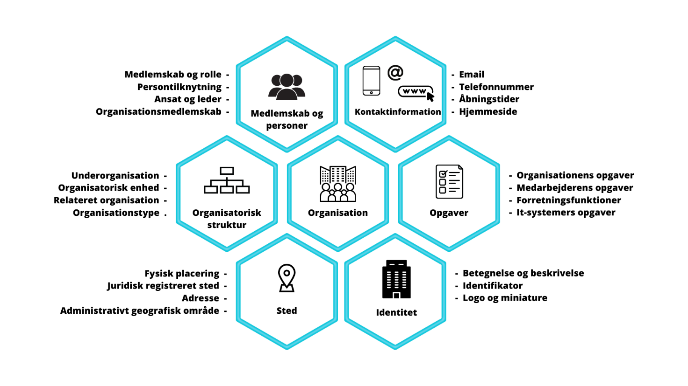

# Brugerbehov til Fællesoffentlig standard for Organisation
# Indledning
Dette dokument indgår i leverancen til Udvalget for Arkitektur og Standarder (UAS). Det er udarbejdet af KL i samarbejde med en tværoffentlig referencegruppe.
Dokumentet indeholder beskrivelser af brugsscenarier for en ny organisationsstandard. Brugsscenarierne skal ud fra et forretningsmæssigt perspektiv beskrive de anvendelsesorienterede behov, som en ny organisationsstandard skal indfri. 
Brugsscenarierne skal i processen med udarbejdelse af en ny organisationsstandard bruges som forretningsbehovene hertil. Efterfølgende skal brugsscenarierne bruges til at validere den nye organisationsstandard i forhold til forretningsbehovene. Derfor beskrives også acceptkriterier for hvert brugsscenarie.
<table>
<tr> <td>Brugsscenarie navn</td> <td> <i>en angivelse af navn for brugsscenariet. Eksempelvis : 
&nbsp;&nbsp;&nbsp;&nbsp;”Scenarie 1	Beskrivelse af organisationens struktur”</i>i> </td> </tr>
<tr> <td> Formål </td> <td> <i>en kort beskrivelse af formålet med brugsscenariet og hvad organisationsstandarden skal kunne beskrive.</i> </td> </tr>
<tr> <td> Beskrivelse </td> <td> <i>en eventuel uddybning af brugsscenariet</i> </td> </tr>
<tr> <td> Eksempel </td> <td> <i>er en mulighed for at kunne uddybe brugsscenariet med eksempler på, hvordan det kunne tænkes at udfolde sig i konkrete brugssituationer.</i> </td> </tr>
<tr> <td> Resultat / Acceptkriterier </td> <td> <i>Beskrivelse af kriterier som skal være opfyldt for brugsscenariet. Bruges til at validere den færdige organisationsstandard imod i forhold til at efterleve brugsscenariet. </i></td> </tr>
</table>

Tabel 1 Forklaring til tabel til beskrivelse af brugsscenarier
# Brugsscenarier for organisationsstandard
Brugsscenarierne er inddelt i en række perspektiver, som den kommende organisationsstandard skal kunne beskrive organisationer ud fra. I figuren nedenfor er vist udvalgte perspektiver, som bruges til at inddele brugsscenarierne efter. 

  

Figur 1 Perspektiver på Organisation  
 
Den tekst der i første omgang beskrev de enkelte brugsscenarier, blev efterfølgende opdelt i mere præcise underafsnit. 
<table>
<tr> <td> Afledt af </td> <td> <i>Angiver den scenariebeskrivelse hvorfra underafsnittets beskrivelse er dannet. Eksempelvis:</i> 
&nbsp;&nbsp;&nbsp;&nbsp;<i>”Scenarie 1	Beskrivelse af organisationens struktur”</i> </td> </tr>
<tr> <td> Beskrivelse </td> <td> <i>Angiver det primære behov i scenariet</i> </td> </tr>
<tr> <td> Kommentar </td> <td> <i>Eventuelle yderligere kommentarer</i> </td> </tr>
<tr> <td> Eksempel </td> <td> <i>Eventuelle eksempler</i> </td> </tr>
<tr> <td> Profil </td> <td><i>Her angives det organisationsperspektiv scenariet er bedømt til at høre under. De enkelte perspektiver kan eventuelt håndteret samlet som anvendelsesprofiler, hvorfor termen ’Profil’ er anvendt her.</i>  </td> </tr>
</table>

 
## Organisatorisk struktur – hvordan er organisationen bygget op

### Scenarie 1	Beskrivelse af organisationens struktur
<table>
<tr> <td> Brugsscenarie </td> <td> Beskrivelse af organisationens struktur med organisationsenheder </td> </tr>
<tr> <td> Formål </td> <td> Organisationsstandarden skal kunne beskrive organisationens indre struktur i form af organisationsenheder og deres indbyrdes relationer. </td> </tr>
<tr> <td> Beskrivelse </td> <td> Organisationsenheder og indbyrdes relationer kan anvendes til at beskrive en organisations struktur. 
Organisationsenheder kan bruges til at opbygge organisationshierarkier, som fx en linjeorganisation.  
Organisationsenheder skal kunne repræsentere mange forskellige enhedstyper, eksempelvis teams, afdelinger, sektioner, kontorer, udvalg, projektgrupper, styregrupper, sammenslutninger i form af selskaber, og lignende. 
Det skal være muligt at angive, hvordan de forskellige organisationsenheder er relateret til hinanden med under- og overordnelsesforhold, og på den måde opbygge organisationshierarkier. </td> </tr>
<tr> <td> Eksempel </td> <td> En kommunal organisation er et eksempel på et organisationshierarki. I den kommunale organisation beskrives de forskellige forvaltninger som organisationsenheder, der er en del af kommunen, og som kan have underordnede organisationsenheder i form af eksempelvis centre, afdelinger og kontorer. Den hierarkiske opbygning sikrer her, at alle organisationsenheders tilhørsforhold til kommunen som organisation kan spores. </td> </tr>
<tr> <td> Resultat / Acceptkriterier </td> <td> <ul> <li>Organisationsstandarden kan beskrive organisationers indre organisatoriske struktur og opbygning, i form af organisationsenheder og deres relationer og over-/underordnelsesforhold.</li>
<li>Organisationsstandarden kan beskrive organisationshierarkier.</li>
<li>Organisationsstandarden er rammesættende i forhold til obligatoriske organisatoriske strukturer.</li>
<li>Organisationsstandarden skal beskrive, hvordan man angiver top-niveauet i en organisationsstruktur.</li> </td> </tr>
</table>

#### Scenarie 1.1	Man skal kunne danne en organisatorisk struktur indeholdende organisationens enheder.
<table>
<tr> <td> Afledt af </td> <td> Scenarie 1   Beskrivelse af organisationens struktur </td> </tr>
<tr> <td> Beskrivelse </td> <td> Organisationsstandarden skal kunne beskrive organisationens indre struktur. . </td> </tr>
<tr> <td> Kommentar </td> <td> En organisations indre opdeling sker gennem oprettelse af organisationsenheder og strukturen opbygges af relationer mellem dem </td> </tr>
<tr> <td> Eksempel </td> <td> En organisation som KL er dels opbygget af mere eller mindre faste afdelinger eller centre (organisatoriske enheder) og dels af midlertidige konstruktioner som projekter og lignende. Disse projekter kan gøres synlige i organisationen ved at oprette organisatoriske enheder og knytte medarbejdere til dem. </td> </tr>
<tr> <td> Profil </td> <td> Organisatorisk struktur </td> </tr>
</table>

#### Scenarie 1.2	Organisationsenhed kan være af en specifik type
<table>
<tr> <td> Afledt af </td> <td> Scenarie1   Beskrivelse af organisationens struktur </td> </tr>
<tr> <td> Beskrivelse </td> <td> Organisationsenheder skal kunne repræsentere mange forskellige enhedstyper, således at myndigheders forskelligartede behov for strukturering af en Organisations enheder kan dokumenteres og kommunikeres.  </td> </tr>
<tr> <td> Kommentar </td> <td> Klassifikationen af enhedstyper bør være autorative </td> </tr>
<tr> <td> Eksempel </td> <td> Eksempelvis: team, afdeling, sektion, kontor, center, udvalg, projektgruppe, styregruppe. </td> </tr>
<tr> <td> Profil </td> <td> Organisatorisk struktur </td> </tr>
</table>

#### Scenarie 1.3	Organisationsenheder kan bruges til at opbygge organisationshierarkier
<table>
<tr> <td> Afledt af </td> <td> Scenarie 1   Beskrivelse af organisationens strukturnens struktur </td> </tr>
<tr> <td> Beskrivelse </td> <td> Organisationsenheder kan bruges til at opbygge organisationshierarkier. </td> </tr>
<tr> <td> Kommentar </td> <td> Der er ingen begrænsning i antal af lag/niveauer i et hierarki. </td> </tr>
<tr> <td> Eksempel </td> <td> Eksempelvis: linjeorganisation </td> </tr>
<tr> <td> Profil </td> <td> Organisatorisk struktur </td> </tr>
</table>

#### Scenarie 1.4	Organisationens enheder kan beskrives med deres indbyrdes relationer
<table>
<tr> <td> Afledt af </td> <td> Scenarie 1   Beskrivelse af organisationens struktur </td> </tr>
<tr> <td> Beskrivelse </td> <td> Det skal være muligt at angive, hvordan de forskellige organisationsenheder er relateret til hinanden. Relationerne kan bruges til at beskrive såvel overordnede, underordnede som sidestillede forhold. </td> </tr>
<tr> <td> Kommentar </td> <td> De forskellige relationsroller bør være autorative  </td> </tr>
<tr> <td> Eksempel </td> <td> Eksempelvis: <ul>
<li> lønafdelingen er en del af HR-afdelingen</li>
<li>jobcenter er en del af socialafdelingen</li></ul> </td> </tr>
<tr> <td> Profil </td> <td> Organisatorisk struktur </td> </tr>
</table>

### Scenarie 2	Beskrivelse af forskellige organisationsstrukturer 
<table>
<tr> <td> Brugsscenarie </td> <td> Beskrivelse af forskellige organisationsstrukturer </td> </tr>
<tr> <td> Formål </td> <td> Organisationsstandarden skal kunne beskrive forskellige opbygninger af organisationsstrukturer indenfor den samme organisation. Dermed skal organisationens forskellige strukturer kunne opbygges i forhold til, hvilket perspektiv de repræsenterer. </td> </tr>
<tr> <td> Beskrivelse </td> <td> Organisationer rummer oftest mere end én organisationsstruktur, der svarer til forskellige syn på organisationen. 
Der kan eksempelvis være (men er ikke begrænset til): <ul>
<li>Linjeorganisation, som repræsenterer det formelle organisationshierarki.</li> 
<li>Lønorganisationen som den er opbygget i løn- og personalesystemet</li>
<li>MED-organisationen, som repræsenterer arbejdet med arbejdsmiljø</li></ul>
Fremfor at samle det hele i én organisationsstruktur skal organisationsstandarden give mulighed for at beskrive flere forskellige organisationsstrukturer indenfor den samme organisation. For hver organisationsstruktur skal angives type, eksempelvis om det er Linjeorganisation. 
Organisationsstandarden skal muliggøre relationer mellem organisationsenheder i forskellige hierarkier, eller også at organisationsenheder optræder i forskellige hierarkier. </td> </tr>
<tr> <td> Eksempel </td> <td> En kommunal organisation har flere samtidige organisationshierarkier: linjeorganisationen der repræsenterer organiseringen af arbejdet, og lønorganisationen, der repræsenterer organisationen i løn- og personalesystemet. De organisationsenheder der repræsenterer kommunens forvaltninger går igen i begge organisationshierarkier. </td> </tr>
<tr> <td> Resultat / Acceptkriterier </td> <td> Med organisationsstandarden kan beskrives forskellige organisationsstrukturer indenfor en organisation.   </td> </tr>
</table>

#### Scenarie 2.1	En organisation kan have flere funktionelt forskellige strukturer
<table>
<tr> <td> Afledt af </td> <td> Scenarie 2   Beskrivelse af forskellige organisationsstrukturer </td> </tr>
<tr> <td> Beskrivelse </td> <td> Organisationsstandarden skal kunne beskrive forskellige opbygninger af organisationsstrukturer indenfor den samme organisation </td> </tr>
<tr> <td> Kommentar </td> <td> De enkelte typer af organisationsstrukturer bør være baseret på et aftalt udfaldsrum.  </td> </tr>
<tr> <td> Eksempel </td> <td> Der kan eksempelvis være (men er ikke begrænset til): <ul>
<li>Linjeorganisation, som repræsenterer det formelle organisationshierarki. </li>
<li>Lønorganisationen som den er opbygget i løn- og personalesystemet</li>
<li>MED-organisationen, som repræsenterer arbejdet med arbejdsmiljø</li> </td> </tr>
<tr> <td> Profil </td> <td> Organisatorisk struktur </td> </tr>
</table>

#### Scenarie 2.2	En organisations strukturer kan have relationer indbyrdes mellem organisationsenheder
<table>
<tr> <td> Afledt af </td> <td> Scenarie 2  Beskrivelse af forskellige organisationsstrukturer </td> </tr>
<tr> <td> Beskrivelse </td> <td> Organisationsstandarden skal muliggøre relationer mellem organisationsenheder i forskellige hierarkier </td> </tr>
<tr> <td> Kommentar </td> <td> Relationstyper på tværs skal være entydige  </td> </tr>
<tr> <td> Eksempel </td> <td> Eksempelvis kan en administrativ organisationshed i en myndighed være relateret som udførende til en borgervendt organisationsenhed i en kontaktstruktur. </td> </tr>
<tr> <td> Profil </td> <td> Organisatorisk struktur </td> </tr>
</table>

#### Scenarie 2.3	En organisationsenhed kan indgå i mere end en af organisationens strukturer
<table>
<tr> <td> Afledt af </td> <td> Scenarie 2  Beskrivelse af forskellige organisationsstrukturer </td> </tr>
<tr> <td> Beskrivelse </td> <td> De samme organisationsenheder kan optræde i flere forskellige hierarkier. </td> </tr>
<tr> <td> Kommentar </td> <td> Der er ofte en række fællestræk på tværs af en organisations strukturer hvilket skal understøttes således at organisationsenheder kan ”genbruges” på tværs af perspektiver og kontekst. </td> </tr>
<tr> <td> Eksempel </td> <td> Eksempelvis kan kommunikationsafdelingen i en linjeorganisation være den samme kommunikationsafdeling der indgår i en organisations lønstruktur. </td> </tr>
<tr> <td> Profil </td> <td> Organisatorisk struktur </td> </tr>
</table>

### Scenarie 3	Beskrivelse af ændringer i organisationsstrukturen over tid
<table>
<tr> <td> Brugsscenarie </td> <td> Beskrivelse af ændringer i organisationen og elementer heri </td> </tr>
<tr> <td> Formål </td> <td> Organisationsstandarden skal kunne beskrive og håndtere ændringer i organisationsstrukturen og spore udviklingen heri over tid. Derved skal organisationsstandarden understøtte, at en bruger kan få svar på, hvordan organisationen har set ud på et givent tidspunkt i tid.   </td> </tr>
<tr> <td> Beskrivelse </td> <td> Organisationer ændres i løbet af deres levetid, for at reflektere ændringer i strukturen, f.eks. oprettelse af nye kontorer, og nedlæggelse af afdelinger.  
Mange sådanne ændringer planlægges i forvejen. 
Organisationsstandarden skal kunne beskrive at en ændring vil være effektueret (”trådt i kraft”) fra et givet tidspunkt og/eller til et givet tidspunkt. 
Ikrafttrædelse (gyldighed) skal kunne specificeres som:<ul>
<li>Helt åbent (ingen fra og ingen til)</li>
<li>Halvåbent (fra et givet tidspunkt eller til et givet tidspunkt)</li>
<li>Lukket (kun mellem to tidspunkter)</li></ul>
Organisationsstandarden skal også kunne håndtere, at ændringer i organisationen kan gemmes, så brugere kan få svar på, hvordan organisationen har set ud tidligere. </td> </tr>
<tr> <td> Eksempel </td> <td> En medarbejder ansættes i eller fratræder fra en organisationsenhed per et givet tidspunkt. Indtil dette tidspunkt er indtruffet, er denne ændring ikke effektueret, og billedet af organisationen som ”gældende” skal derfor ikke reflektere ændringen inden da. </td> </tr>
<tr> <td> Resultat / Acceptkriterier </td> <td><ul><li>Organisationsstandarden kan beskrive ændringer i organisationen.</li>
<li>Organisationsstandarden kan beskrive planlagte ændringer, som skal effektueres på et givent tidspunkt.</li>
<li>Organisationsstandarden kan beskrive og håndtere tidligere aktive versioner af organisationen.</li> </td> </tr>
</table>

#### Scenarie 3.1	En organisations strukturændringer skal kunne dokumenteres
<table>
<tr> <td> Afledt af </td> <td> Scenarie 3  Beskrivelse af ændringer i organisationsstrukturen </td> </tr>
<tr> <td> Beskrivelse </td> <td> Skal kunne beskrive og håndtere ændringer i organisationsstrukturen og spore udviklingen heri over tid. Derved skal organisationsstandarden understøtte, at det er muligt at få svar på hvordan organisationen har set ud på et givent tidspunkt i tid.  </td> </tr>
<tr> <td> Kommentar </td> <td> Organisationer ændres i løbet af deres levetid, for at reflektere ændringer i strukturen, f.eks. oprettelse af nye kontorer, og nedlæggelse af afdelinger.  </td> </tr>
<tr> <td> Eksempel </td> <td> Eksempelvis kan det gengives hvordan fx Roskilde Sygehus var organiseret for 2 år siden.  </td> </tr>
<tr> <td> Profil </td> <td> Organisatorisk struktur </td> </tr>
</table>

#### Scenarie 3.2	Organisationsenheders livscyklus skal kunne dokumenteres 
<table>
<tr> <td> Afledt af </td> <td> Scenarie 3  Beskrivelse af ændringer i organisationsstrukturen </td> </tr>
<tr> <td> Beskrivelse </td> <td> En organisationsenheds oprettelse, nedlæggelse samt relationer til øvrige enheder, skal kunne registreres. 
Ikrafttrædelse (gyldighed) skal kunne specificeres som:<ul>
<li>Helt åbent (ingen fra og ingen til)</li>
<li>Halvåbent (fra et givet tidspunkt eller til et givet tidspunkt)</li>
<li>Lukket (kun mellem to tidspunkter</li> </td> </tr>
<tr> <td> Kommentar </td> <td> Viden om organisationsenheders livscyklus giver indsigt i organisationens løbende transformation. Der kan være interne behov for at se tilstand og hvornår ændringer træder i kraft, men eksterne parter kan også have behov for denne viden til fx planlægning samt håndtering af organisatoriske samarbejder. </td> </tr>
<tr> <td> Eksempel </td> <td> Eksempelvis kan en myndighed etablere en midlertidig projektorganisation der er ”aktiv” i en afgrænset periode hvor projektet/programmet afvikles  – Livscyklus: ’Lukket’ </td> </tr>
<tr> <td> Profil </td> <td> Organisatorisk struktur </td> </tr>
</table>

#### Scenarie 3.3	Planlagte ændringer af organisationens struktur skal kunne beskrives
<table>
<tr> <td> Afledt af </td> <td> Scenarie 3  Beskrivelse af ændringer i organisationsstrukturen </td> </tr>
<tr> <td> Beskrivelse </td> <td> Organisationsstandarden kan beskrive planlagte ændringer, som skal effektueres på et givent tidspunkt. Forventet ikrafttræden samt årsag bør kunne registreres. </td> </tr>
<tr> <td> Kommentar </td> <td> Det skal være muligt at registrere ændringer med en fremtidig ikrafttrædelsesdato da organisatoriske tilpasninger oftest planlægges førend de skal træde i kraft. </td> </tr>
<tr> <td> Eksempel </td> <td> Eksempelvis planlægger en kommune med en sammenlægning af to kontorer til et kontor efter årsskiftet. Ændringer for henholdsvis de 2 eksisterende kontor samt det nye kontor registreres med det samme og effektueres ved årsskiftet.  </td> </tr>
<tr> <td> Profil </td> <td> Organisatorisk struktur </td> </tr>
</table>

 
## Basisinformation om organisationen

### Scenarie 4	Beskrivelse af organisationen 
<table>
<tr> <td> Brugsscenarie </td> <td> Beskrivelse af organisationen </td> </tr>
<tr> <td> Formål </td> <td> Organisationsstandarden skal kunne beskrive de grundlæggende informationer om organisationen og dens formelle repræsentation i forhold til omverdenen. </td> </tr>
<tr> <td> Beskrivelse </td> <td> En organisation er en juridisk enhed som fx en myndighed eller en virksomhed. Organisationsstandarden skal kunne beskrive organisationens navn, type og eventuelle sammenhæng med andre organisationer. </td> </tr>
<tr> <td> Eksempel </td> <td>  </td> </tr>
<tr> <td> Resultat / Acceptkriterier </td> <td> Organisationsstandarden kan beskrive de grundlæggende oplysninger om en organisation og dens forhold til omverden </td> </tr>
</table>

#### Scenarie 4.1	Organisationens grundlæggende oplysninger kan beskrives
<table>
<tr> <td> Afledt af </td> <td> Scenarie 4  Beskrivelse af organisationen </td> </tr>
<tr> <td> Beskrivelse </td> <td> ID-oplysninger, navne, beskrivelse, type, hjemmeside, logo, historik, stedfæstelse og adresse.  </td> </tr>
<tr> <td> Kommentar </td> <td>  </td> </tr>
<tr> <td> Eksempel </td> <td>  </td> </tr>
<tr> <td> Profil </td> <td> Identitet </td> </tr>
</table>

#### Scenarie 4.2	Organisationens sammenhæng til andre organisationer kan beskrives
<table>
<tr> <td> Afledt af </td> <td> Scenarie 4  Beskrivelse af organisationen </td> </tr>
<tr> <td> Beskrivelse </td> <td> Ved at angive relationer til andre organisationer kan disses indbyrdes sammenhæng beskrives. </td> </tr>
<tr> <td> Kommentar </td> <td> Der skal kunne oprettes relationer mellem organisationer, som angiver en eller anden sammenhæng mellem disse organisationer. </td> </tr>
<tr> <td> Eksempel </td> <td> Finansministeriet (organisation) har en relation (ejer, ansvarlig for el. lign)  til Digitaliseringsstyrelsen (organisation).  </td> </tr>
<tr> <td> Profil </td> <td>  </td> </tr>
</table>

#### Scenarie 4.3	En klassifikation over organisationstyper kan anvendes
<table>
<tr> <td> Afledt af </td> <td> Scenarie 4  Beskrivelse af organisationen </td> </tr>
<tr> <td> Beskrivelse </td> <td> Organisationer kan beskrives via en relation til en organisationstype i en dedikeret klassifikation. </td> </tr>
<tr> <td> Kommentar </td> <td>  </td> </tr>
<tr> <td> Eksempel </td> <td>  </td> </tr>
<tr> <td> Profil </td> <td> Identitet </td> </tr>
</table>
 

### Scenarie 5	Angivelse af egenskaber ved organisation
<table>
<tr> <td> Brugsscenarie </td> <td> Angivelse af egenskaber ved organisation </td> </tr>
<tr> <td> Formål </td> <td> Organisationsstandarden skal kunne angive egenskaber ved organisationen i forhold til om den er en myndighed, virksomhed eller andet. </td> </tr>
<tr> <td> Beskrivelse </td> <td> En organisation kan være en virksomhed, der er registreret med CVR-nummer i CVR-registeret eller en myndighed som fx en kommune eller en region. Organisationsstandarden skal kunne angive organisationens type. </td> </tr>
<tr> <td> Eksempel </td> <td>  </td> </tr>
<tr> <td> Resultat / Acceptkriterier </td> <td><ul><li>Med organisationsstandarden kan angives type for organisationen</li>
<li>Angivelsen af type er samordnet med eksisterende beskrivelser af Virksomhed, Myndighed og Foreninger.</li> </td> </tr>
</table>

#### Scenarie 5.1	En fælles offentlig klassifikation for typer af organisationer kan anvendes
<table>
<tr> <td> Afledt af </td> <td> Scenarie 5  Angivelse af egenskaber ved organisation </td> </tr>
<tr> <td> Beskrivelse </td> <td> Organisationsstandarden skal kunne angive egenskaber ved organisationen i forhold til om den er en myndighed, virksomhed eller andet.  </td> </tr>
<tr> <td> Profil </td> <td> Identitet </td> </tr>
<tr> <td>  </td> <td>  </td> </tr>
<tr> <td>  </td> <td>  </td> </tr>
</table>

## Adresse

### Scenarie 6	Beskrivelse af organisationens adresse
<table>
<tr> <td> Brugsscenarie </td> <td> Beskrivelse af organisationens adresser </td> </tr>
<tr> <td> Formål </td> <td> Organisationsstandarden skal kunne angive en adresse med en type af adresse (postadresse og adgangsadresse) på en organisation og organisationsenheder. </td> </tr>
<tr> <td> Beskrivelse </td> <td> Danske adresser kan findes i Danmarks Adresseregister (DAR), som er det autoritative register for alle danske adresser. Organisationsstandarden skal også kunne håndtere udenlandske adresser.  
Organisationsstandarden skal understøtte, at de officielle fysiske adresser på organisationer og organisationsenheder kan angives. </td> </tr>
<tr> <td> Eksempel </td> <td>  </td> </tr>
<tr> <td> Resultat / Acceptkriterier </td> <td><ul><li>Organisationsstandarden kan angive fysiske adresser i overensstemmelse med adresser i DAR.</li> 
<li>Organisationsstandarden kan håndtere udenlandske adresser.</li> </td> </tr>
</table>

#### Scenarie 6.1	En organisation kan tilknyttes en adresse
<table>
<tr> <td> Afledt af </td> <td> Scenarie 6  Beskrivelse af organisationen adresse </td> </tr>
<tr> <td> Beskrivelse </td> <td> Organisationsstandarden skal kunne angive en adresse på en organisation. 
Organisationsstandarden skal understøtte, at de officielle fysiske adresser på organisationer kan angives. </td> </tr>
<tr> <td> Kommentar </td> <td> Her er tale om organisationens autoritative, officielle adresse på organisationen som helhed – og ikke ”blot” en kontaktadresse. 
Danske adresser bør/skal angives ved at udpege en adresse i DAR </td> </tr>
<tr> <td> Eksempel </td> <td>  </td> </tr>
<tr> <td> Profil </td> <td> Sted </td> </tr>
</table>

#### Scenarie 6.2	En organisationsenhed kan tilknyttes en adresse
<table>
<tr> <td> Afledt af </td> <td> Scenarie 6  Beskrivelse af organisationen adresse </td> </tr>
<tr> <td> Beskrivelse </td> <td> Organisationsstandarden skal kunne angive en adresse på en organisationsenhed. 
Organisationsstandarden skal understøtte, at de officielle fysiske adresser på organisationsenheder kan angives. </td> </tr>
<tr> <td> Kommentar </td> <td> Her er tale om organisationens autoritative, officielle adresse på en organisationsenhed – og ikke ”blot” en kontaktadresse.  
Bemærk at der ikke altid behøver at være en selvstændig adresse på organisationsenheden. Hvis alle organisationsenheder ligger på samme adresse som organisationen, vil organisationens adresse være ”default”. 
Danske adresser bør/skal angives ved at udpege en adresse i DAR </td> </tr>
<tr> <td> Eksempel </td> <td>  </td> </tr>
<tr> <td> Profil </td> <td> Sted </td> </tr>
</table>

#### Scenarie 6.3	Man kan anvende flere typer af adresser
<table>
<tr> <td> Afledt af </td> <td> Scenarie 6  Beskrivelse af organisationen adresse </td> </tr>
<tr> <td> Beskrivelse </td> <td> Organisationsstandarden skal kunne angive en adresse med en type af adresse (postadresse og adgangsadresse og besøgsadresse). </td> </tr>
<tr> <td> Kommentar </td> <td>  </td> </tr>
<tr> <td> Eksempel </td> <td>  </td> </tr>
<tr> <td> Profil </td> <td> Sted </td> </tr>
</table>

#### Scenarie 6.4	Standarden kan håndtere udenlandske adresser
<table>
<tr> <td> Afledt af </td> <td> Scenarie 6  Beskrivelse af organisationen adresse </td> </tr>
<tr> <td> Beskrivelse </td> <td> Organisationsstandarden kan håndtere udenlandske adresser </td> </tr>
<tr> <td> Kommentar </td> <td> Udenlandske adresser har ofte anderledes format end danske og kan ikke angives ved opslag/reference til DAR. Derfor skal disse adresser kunne angives i klartekst. </td> </tr>
<tr> <td> Eksempel </td> <td>  </td> </tr>
<tr> <td> Profil </td> <td> Sted </td> </tr>
</table>

 
## Kontaktoplysninger

### Scenarie 7	Angivelse af kontaktoplysninger
<table>
<tr> <td> Brugsscenarie </td> <td> Beskrivelse af kontaktoplysninger </td> </tr>
<tr> <td> Formål </td> <td> Organisationsstandarden skal kunne beskrive alle de forskellige typer af fysiske og digitale kontaktoplysninger, som en organisation og organisationsenheder kan have, herunder også eventuelle åbningstider. </td> </tr>
<tr> <td> Beskrivelse </td> <td> Udover den officielle fysiske adresse har organisationer og organisationsenheder også andre mulige kontaktoplysninger, der vedrører kontaktkanaler som eksempelvis mail, telefon, digital post og eventuelt URL for virtuelle organisationer. Det skal også være muligt at kunne flere forskellige typer af kontaktoplysninger samt at angive åbningstider for, hvornår kontaktkanalen er åben. 
Typer af kontaktoplysninger skal kunne fastlægges i et katalog. </td> </tr>
<tr> <td> Eksempel </td> <td> Kommunens borgerservice på Algade 10, Korsbæk, har åbent for telefoniske henvendelser hverdage i tidsrummet 9.00 – 17.00 </td> </tr>
<tr> <td> Resultat / Acceptkriterier </td> <td> <ul> <li>Organisationsstandarden kan beskrive forskellige typer af kontaktoplysninger</li>
<li>Der kan tilknyttes åbningstider til kontaktoplysningerne.</li> </td> </tr>
</table>

#### Scenarie 7.1	Organisation og enheder kan tildeles kontaktoplysninger
<table>
<tr> <td> Afledt af </td> <td> Scenarie 7  Angivelse af kontaktoplysninger </td> </tr>
<tr> <td> Beskrivelse </td> <td> Organisationer og enheder kan beskrives med relevante typer af kontaktoplysninger. </td> </tr>
<tr> <td> Kommentar </td> <td> En organisation, dens enheder og/eller dens medlemmer kan kontaktes på mange forskellige måder. Disse skal kunne angives i standarden. </td> </tr>
<tr> <td> Eksempel </td> <td> mail, telefon, digital post og eventuelt URL for virtuelle organisationer. </td> </tr>
<tr> <td> Profil </td> <td> Kontaktinformation </td> </tr>
</table>

#### Scenarie 7.2	Kontaktoplysninger kan tilknyttes åbningstider
<table>
<tr> <td> Afledt af </td> <td> Scenarie 7  Angivelse af kontaktoplysninger </td> </tr>
<tr> <td> Beskrivelse </td> <td> Der kan tilknyttes åbningstider til kontaktoplysningerne. </td> </tr>
<tr> <td> Kommentar </td> <td> Nogle af kontaktkanalerne er kun åbne i bestemte tidsrum, mens andre er åbne hele tiden </td> </tr>
<tr> <td> Eksempel </td> <td> Besøgstid: 12-13 og 15-17 
Vareindlevering: 7-11 
Telefon: 9-12 og 13-17 (mandag – torsdag), 9-12 og 13-15 (fredag), lukket (lørdag og søndag) 
Hjemmeside: 0-24 alle ugens dage </td> </tr>
<tr> <td> Profil </td> <td> Kontaktinformation </td> </tr>
</table>

#### Scenarie 7.3	Type af kontaktoplysning kan beskrives som klassifikation
<table>
<tr> <td> Afledt af </td> <td> Scenarie 7  Angivelse af kontaktoplysninger </td> </tr>
<tr> <td> Beskrivelse </td> <td> Typer af kontaktoplysninger skal kunne fastlægges i et katalog. </td> </tr>
<tr> <td> Kommentar </td> <td> Kontakttyperne bør ikke udelukkende kunne vælges frit, men skal vælges i en autoriseret klassifikation. Der bør dog kunne tilføjes egne kontakttyper, som evt. senere kan optages i den fælles autoritative liste. </td> </tr>
<tr> <td> Eksempel </td> <td> <ul> <li>Besøgsadresse</li>
<li>Telefon</li>
<li>Mail</li>
<li>DigitalPost</li>
<li>Vareindlevering</li>
<li>… </li></td> </tr>
<tr> <td> Profil </td> <td> Kontaktinformation </td> </tr>
</table>

 
## Relationer mellem organisationer og medarbejdere

### Scenarie 8	Beskrivelse af relationer mellem organisationer og medarbejdere
<table>
<tr> <td> Brugsscenarie </td> <td> Beskrivelse af relationer mellem organisationer og medarbejdere </td> </tr>
<tr> <td> Formål </td> <td> Organisationsstandarden skal kunne beskrive relationer mellem organisationer, f.eks. ved samarbejde, eller når organisationer er i et over-/underordnelsesforhold til en anden organisation.   </td> </tr>
<tr> <td> Beskrivelse </td> <td> Organisationer indgår i forskellige typer af relationer med hinanden. Relationerne kan være i form af:<ul>
<li>organisatoriske samarbejder, hvor organisationer går sammen om eksempelvis en specifik opgave</li>
<li>under- og overordnelsesforhold, hvor et kontor er underordnet i forhold til en afdeling</li>
<li>medarbejder til medarbejder-relationer</li> </td> </tr>
<tr> <td> Eksempel </td> <td> En gruppe af kommuner har etableret et tværkommunalt samarbejde om digitalisering. Kommunerne stiller hver især med medarbejdere med de nødvendige kompetencer, som indstationeres i samarbejdet men fortsat er formelt ansatte i egne kommuner. Organisationsstandarden skal kunne beskrive, hvordan samarbejdet er struktureret og håndtere medarbejdernes tilhørsforhold og funktioner. Herudover medarbejderes interne relationer som f.eks. at en medarbejder er mentor for en anden eller at en medarbejder er ansvarlig for en anden medarbejder eller et it-system/”robot”. </td> </tr>
<tr> <td> Resultat / Acceptkriterier </td> <td> <ul> <li>Organisationsstandarden kan beskrive samarbejde mellem organisationer</li>
<li>Organisationsstandarden kan beskrive, at en organisation er i et under- eller overordnelsesforhold til en anden organisation.</li>
<li>Organisationsstandarden kan beskrive, at organisationer kan relateres sideordnet.</li> 
<li>Organisationsstandarden kan beskrive interne relationer mellem organisationsmedlemmer.</li> </td> </tr>
</table>

Tabel 6 Beskrivelse af relationer mellem organisationer og medarbejdere

#### Scenarie 8.1	Relationer mellem selvstændige organisationer kan beskrives
<table>
<tr> <td> Afledt af </td> <td> Scenarie 8  Beskrivelse af relationer mellem organisationer og medarbejdere </td> </tr>
<tr> <td> Beskrivelse </td> <td> Organisationsstandarden skal kunne beskrive relationer mellem organisationer 
Organisationsstandarden kan beskrive, at en organisation er i et under- eller overordnelsesforhold til en anden organisation. 
Organisationsstandarden kan beskrive, at organisationer kan relateres sideordnet.  </td> </tr>
<tr> <td> Kommentar </td> <td> Det kan være hensigtsmæssigt at kunne angive formelle relationer selvom der er tale om to selvstændige organisationer. Eks. Ved. Samarbejde mellem to organisationer eller ved forhold hvor der er en tilknytning – kortvarig som langvarig. </td> </tr>
<tr> <td> Eksempel </td> <td> En gruppe af kommuner har etableret et tværkommunalt samarbejde om digitalisering. Kommunerne stiller hver især med medarbejdere med de nødvendige kompetencer, som indstationeres i samarbejdet men fortsat er formelt ansatte i egne kommuner 
Eksempelvis indgår to forskellige hospitaler et formelt samarbejde inden for kræftbehandling. 
Eksempelvis beskrives forholdet mellem de to organisationer - Finansministeriet og Digitaliseringsstyrelsen </td> </tr>
<tr> <td> Profil </td> <td> Medlemskab og personer </td> </tr>
</table>

#### Scenarie 8.2	Relationer mellem en organisations medlemmer kan beskrives
<table>
<tr> <td> Afledt af </td> <td> Scenarie 8  Beskrivelse af relationer mellem organisationer og medarbejdere </td> </tr>
<tr> <td> Beskrivelse </td> <td> Medarbejder til medarbejder-relationer. Organisationsstandarden kan beskrive interne relationer mellem organisationsmedlemmer. </td> </tr>
<tr> <td> Kommentar </td> <td> Medarbejdere kan have en række relationer til hinanden – formelle som uformelle. Det anbefales at centrale formelle medlemsrelationer standardiseres </td> </tr>
<tr> <td> Eksempel </td> <td> Eksempler:<ul>
<li>Et medlem kan være "mentor for" et andet medlem</li> 
<li>Et medlem kan være "ansvarlig for" andet medlem (især hvis det er en NPE (NonPersonEntity)</li> 
<li>Et medlem kan være "chef for" et andet medlem</li> 
<li>Et medlem kan være "tillidsrepræsentant for" et andet medlem</li> </td> </tr>
<tr> <td> Profil </td> <td> Medlemskab og personer </td> </tr>
</table>

#### Scenarie 8.3	En organisations medarbejders tilhørsforhold kan beskrives
<table>
<tr> <td> Afledt af </td> <td> Scenarie 8  Beskrivelse af relationer mellem organisationer og medarbejdere </td> </tr>
<tr> <td> Beskrivelse </td> <td> Organisationsstandarden skal kunne håndtere medarbejdernes tilhørsforhold og funktioner. 
Der SKAL være et (og kun et) medlemskab mellem et organisationsmedlem og organisationen.  
Der KAN være et medlemskab mellem organisationsmedlemmet og en eller flere organisationsenheder.   </td> </tr>
<tr> <td> Kommentar </td> <td> Det anbefales at standardisere de forskellige tilhørsforhold som en medarbejder kan have. Det kan også være relevant at anføre bemærkninger til dette tilhørsforhold. </td> </tr>
<tr> <td> Eksempel </td> <td> Eksempler: 
Ole er "ansat" på Næstved Sygehus (organisation)  
Ole "arbejder på" Kirurgisk afdeling på Næstved Sygehus (organisationsenhed)  
Ole "er medlem af" Vinklubben på Næstved Sygehus (organisationsenhed) </td> </tr>
<tr> <td> Profil </td> <td> Medlemskab og personer </td> </tr>
</table>

 
## Forretningsfunktion – hvad arbejder organisationen med

### Scenarie 9	Beskrivelse af hvad organisationen arbejder med
<table>
<tr> <td> Brugsscenarie </td> <td> Beskriv hvad organisationen arbejder med </td> </tr>
<tr> <td> Formål </td> <td> Organisationsstandarden skal kunne beskrive, hvad organisationen, dens organisationsenheder og it-systemer arbejder med. </td> </tr>
<tr> <td> Beskrivelse </td> <td> Med organisationsstandarden skal det være muligt at beskrive, hvilke funktioner organisationens organisationsenheder udfører, hvilke it-systemer organisationsenheden anvender, og hvad it-systemet bruges til eller understøtter.  
Man skal kunne danne et overblik over, hvilke enheder eller it-systemer, der arbejder med hvad. 
Hvad organisationerne arbejder med vil typisk gå igen på tværs af tilsvarende organisationer, f.eks. kommuner, der har stort overlap i hvilke funktioner, de samlet udfører. </td> </tr>
<tr> <td> Eksempel </td> <td> En kommune har i forbindelse med implementering af et it-system behov for at registrere, at jobcenteret er et ”Henvendelsessted” for borgere. Kommunen har derfor behov for at kunne beskrive funktionen ”Henvendelsessted”, som kan knyttes til den organisatoriske enhed for jobcenteret. </td> </tr>
<tr> <td> Resultat / Acceptkriterier </td> <td> <ul> <li>Med organisationsstandarden kan beskrives de funktioner, som organisationen udfører, så det er tydeligt, hvem der arbejder med hvad.</li> 
<li>De forskellige arbejdsopgaver eller funktioner kan knyttes til en eller flere organisationsenheder.</li> </td> </tr>
</table>

#### Scenarie 9.1	Organisationens opgaver og funktioner kan beskrives
<table>
<tr> <td> Afledt af </td> <td> Scenarie 9   Beskriv hvad organisationen arbejder med </td> </tr>
<tr> <td> Beskrivelse </td> <td> Med organisationsstandarden kan beskrives de funktioner, som organisationen udfører </td> </tr>
<tr><td>Kommentar</td> <td>  </td> </tr>
<tr> <td>Eksempel</td> <td>  </td> </tr>
<tr> <td> Profil </td> <td> Opgaver </td> </tr>
</table>

#### Scenarie 9.2	Organisationens enheders opgaver og funktioner kan beskrives
<table>
<tr> <td> Afledt af </td> <td> Scenarie 9   Beskriv hvad organisationen arbejder med </td> </tr>
<tr> <td> Beskrivelse </td> <td> En enhed kan have flere opgaver og funktioner. 
Forskellige opgaver eller funktioner kan knyttes til en eller flere organisationsenheder. </td> </tr>
<tr><td>Kommentar</td> <td>  </td> </tr>
<tr> <td>Eksempel</td> <td>  </td> </tr>
<tr> <td> Profil </td> <td> Opgaver </td> </tr>
</table>

#### Scenarie 9.3	Organisationens it-systemers opgaver og funktioner kan beskrives
<table>
<tr> <td> Afledt af </td> <td> Scenarie 9   Beskriv hvad organisationen arbejder med </td> </tr>
<tr> <td> Beskrivelse </td> <td> hvad it-systemet bruges til eller understøtter. </td> </tr>
<tr><td>Kommentar</td> <td>  </td> </tr>
<tr> <td>Eksempel</td> <td>  </td> </tr>
<tr> <td> Profil </td> <td> Opgaver </td> </tr>
</table>

#### Scenarie 9.4	Organisationens relation til specifikke it-systemer kan beskrives
<table>
<tr> <td> Afledt af </td> <td> Scenarie 9   Beskriv hvad organisationen arbejder med </td> </tr>
<tr> <td> Beskrivelse </td> <td> hvilke it-systemer organisationsenheden anvender </td> </tr>
<tr><td>Kommentar</td> <td>  </td> </tr>
<tr> <td>Eksempel</td> <td>  </td> </tr>
<tr> <td> Profil </td> <td> Opgaver </td> </tr>
</table>

 
## Personer, NPE’er og it-løsninger – hvem er medlemmer af organisationen

### Scenarie 10	Tilknyt personer til organisationen
<table>
<tr> <td> Brugsscenarie </td> <td> Beskriv personers og NPE’ers tilknytning til organisationen </td> </tr>
<tr> <td> Formål </td> <td> Organisationsstandarden skal kunne beskrive, hvordan personer er tilknyttet organisationer og organisatoriske enheder, så de kan få de rigtige rettigheder og pligter i forhold hertil. </td> </tr>
<tr> <td> Beskrivelse </td> <td> Personer kan være tilknyttet organisationer på forskellig vis, eksempelvis som ansatte og som ledere af organisationer eller med angivelse af det arbejdssted, hvor medarbejderen udfører sin opgave. Samme person kan have flere ansættelser eller flere roller i samme organisation </td> </tr>
<tr> <td> Eksempel </td> <td> En person, Jens, er ansat i en kommune under gældende overenskomst som sosu-medhjælper. I samme kommune er Jens også ansat 10 timer om ugen på et bosted, hvor han hjælper med at supportere deres it. Organisationsstandarden skal kunne beskrive begge Jens’ ansættelser i den kommunale organisation og de forskellige roller de indebærer. </td> </tr>
<tr> <td> Resultat / Acceptkriterier </td> <td> <ul> <li>Organisationsstandarden kan beskrive, hvordan personer er tilknyttet organisationer og organisationsenheder.</li> 
<li>Organisationsstandarden skal kunne håndtere, at personer kan have flere tilknytninger til en organisation, fx i form af flere ansættelsesforhold.</li> 
<li>Organisationsstandarden skal også kunne rumme markering af, om et tilknytningsforhold er rettighedsbærende i forhold til organisationens it-systemer.</li> </td> </tr>
</table>

#### Scenarie 10.1	En person kan tilknyttes en organisation
<table>
<tr> <td> Afledt af </td> <td> Scenarie 10   Beskriv personers og NPE’ers tilknytning til organisationen </td> </tr>
<tr> <td> Beskrivelse </td> <td> Organisationsstandarden kan beskrive, hvordan personer er tilknyttet organisationer. 
Organisationsstandarden skal kunne håndtere, at personer kan have flere tilknytninger til en organisation, fx i form af flere ansættelsesforhold.  
Personer kan være tilknyttet organisationer på forskellig vis, eksempelvis som ansatte og som ledere af organisationer eller med angivelse af det arbejdssted, hvor medarbejderen udfører sin opgave. Samme person kan have flere ansættelser eller flere roller i samme organisation </td> </tr>
<tr><td>Kommentar</td> <td>  </td> </tr>
<tr> <td>Eksempel</td> <td>  </td> </tr>
<tr> <td> Profil </td> <td> Medlemskab og personer </td> </tr>
</table>

#### Scenarie 10.2	En person kan tilknyttes en organisatoriskenhed
<table>
<tr> <td> Afledt af </td> <td> Scenarie 10   Beskriv personers og NPE’ers tilknytning til organisationen </td> </tr>
<tr> <td> Beskrivelse </td> <td> Organisationsstandarden kan beskrive, hvordan personer er tilknyttet organisationsenheder. 
Personer kan være tilknyttet organisationer på forskellig vis, eksempelvis som ansatte og som ledere af organisationer eller med angivelse af det arbejdssted, hvor medarbejderen udfører sin opgave. Samme person kan have flere ansættelser eller flere roller i samme organisation </td> </tr>
<tr><td>Kommentar</td> <td>  </td> </tr>
<tr> <td>Eksempel</td> <td>  </td> </tr>
<tr> <td> Profil </td> <td> Medlemskab og personer </td> </tr>
</table>

#### Scenarie 10.3	En person eller en NPE kan have en rolle
<table>
<tr> <td> Afledt af </td> <td> Scenarie 10   Beskriv personers tilknytning til organisationen </td> </tr>
<tr> <td> Beskrivelse </td> <td> Samme person kan have […] flere roller i samme organisation. </td> </tr>
<tr> <td> Profil </td> <td> Medlemskab og personer </td> </tr>
<tr> <td>  </td> <td>  </td> </tr>
<tr> <td>  </td> <td>  </td> </tr>
</table>

#### Scenarie 10.4	En tilknyttet persons eller NPE’s rettigheder og pligter kan beskrives
<table>
<tr> <td> Afledt af </td> <td> Scenarie 10   Beskriv personers tilknytning til organisationen </td> </tr>
<tr> <td> Beskrivelse </td> <td> En persons tilknytning til en organisation og/eller en organisatoriskenhed giver rettigheder og pligter i den givne sammenhæng. </td> </tr>
<tr><td>Kommentar</td> <td>  </td> </tr>
<tr> <td>Eksempel</td> <td>  </td> </tr>
<tr> <td> Profil </td> <td> Medlemskab og personer </td> </tr>
</table>

#### Scenarie 10.5	En persons eller NPE’s adgangsrettigheder til organisationens it-system kan beskrives
<table>
<tr> <td> Afledt af </td> <td> Scenarie 10   Beskriv personers tilknytning til organisationen </td> </tr>
<tr> <td> Beskrivelse </td> <td> Organisationsstandarden skal også kunne rumme markering af, om et tilknytningsforhold er rettighedsbærende i forhold til organisationens it-systemer. </td> </tr>
<tr><td>Kommentar</td> <td>  </td> </tr>
<tr> <td>Eksempel</td> <td>  </td> </tr>
<tr> <td> Profil </td> <td> Medlemskab og personer </td> </tr>
</table>

### Scenarie 11	Beskriv jobfunktionsroller
<table>
<tr> <td> Brugsscenarie </td> <td> Beskriv jobfunktionsroller </td> </tr>
<tr> <td> Formål </td> <td> Organisationsstandarden skal via relation til en klassifikation kunne beskrive, hvilke jobfunktionsroller organisationens medlemmer har i forhold til deres medlemskab af organisationen. </td> </tr>
<tr> <td> Beskrivelse </td> <td> Organisationens medlemmers jobfunktion (arbejdsopgave) skal kunne tilknyttes et medlem i organisationen. Et medlem af en organisation kan have ingen eller flere jobfunktioner. En jobfunktion er ikke det samme som en stillingsbetegnelse, og en stilling indebærer gerne en række nødvendige jobfunktioner. 
De forskellige jobfunktioner som skal udføres i en organisation, skal kunne opbygges og beskrives i et katalog. Kataloget over jobfunktionsroller skal kunne rumme en personuafhængig beskrivelse af de jobfunktioner, der er nødvendige at udføre for organisationen.  
Derved kan organisationens interessenter danne et overblik over, hvem der arbejder med hvad. 
 </td> </tr>
<tr> <td> Eksempel </td> <td>  </td> </tr>
<tr> <td> Resultat / Acceptkriterier </td> <td> Organisationsstandarden kan beskrive et katalog over jobfunktionsroller, der uafhængigt af de konkrete personer beskriver de nødvendige jobfunktioner i en organisation. </td> </tr>
</table>

#### Scenarie 11.1	Organisationen kan have en klassifikation af jobfunktionsroller
<table>
<tr> <td> Afledt af </td> <td> Scenarie 11   Beskriv jobfunktionsrolle </td> </tr>
<tr> <td> Beskrivelse </td> <td> Organisationsstandarden kan beskrive et katalog over jobfunktionsroller, der uafhængigt af de konkrete personer beskriver de nødvendige jobfunktioner i en organisation. </td> </tr>
<tr> <td> Kommentar </td> <td> De forskellige jobfunktioner som skal udføres i en organisation, skal kunne opbygges og beskrives i et katalog. Kataloget over jobfunktionsroller skal kunne rumme en personuafhængig beskrivelse af de jobfunktioner, der er nødvendige at udføre for organisationen </td> </tr>
<tr> <td> Eksempel </td> <td> <ul> <li>Køre truck</li>
<li>Autorisere rejsebilag</li>
<li>Godkende tidsregistrering</li>
<li>…</li> </td> </tr>
<tr> <td> Profil </td> <td> Opgaver </td> </tr>
</table>

#### Scenarie 11.2	Medlemmer af organisationen kan have jobfunktionsroller
<table>
<tr> <td> Afledt af </td> <td> Scenarie 11   Beskriv jobfunktionsrolle </td> </tr>
<tr> <td> Beskrivelse </td> <td> Organisationens medlemmers jobfunktion (arbejdsopgave) skal kunne tilknyttes et medlem i organisationen. Et medlem af en organisation kan have ingen eller flere jobfunktioner. </td> </tr>
<tr> <td> Kommentar </td> <td> Et organisationsmedlems arbejdsopgaver og rettigheder kan beskrives gennem tildelingen af en række jobfunktioner. Den samlede ”mængde” af jobfunktioner beskriver hvad organisationsmedlemmet arbejder med og har adgang til, rettighedsmæssigt.  
Dette kan gøres ”ved siden” af it-systemerne, hvilket betyder at rettigheder kan håndhæves uanset hvilke it-systemer der anvendes. </td> </tr>
<tr> <td> Eksempel </td> <td>  </td> </tr>
<tr> <td> Profil </td> <td> Opgaver </td> </tr>
</table>

### Scenarie 12	Delegering af opgaver i organisationen
<table>
<tr> <td> Brugsscenarie </td> <td> Beskrivelse af delegering af opgaver i organisationen </td> </tr>
<tr> <td> Formål </td> <td> Organisationsstandarden skal kunne beskrive, at opgaver delegeres i organisationen fra en aktør (f.eks. organisationsenhed) til en anden eller på tværs af organisationer, fx fra et sygehus til et andet sygehus. </td> </tr>
<tr> <td> Beskrivelse </td> <td> Delegering er en overdragelse af en (bestemt) opgave fra en bestemt aktør til en anden aktør.  
Organisationstandarden skal beskrive, at en opgave der udføres af aktører i organisationen, sker efter delegering fra en anden aktør.  
Derved skal det kunne beskrives, hvordan opgaver er delegeret mellem organisationsenheder og personer indenfor organisationen eller mellem organisationer.</td> </tr>
<tr> <td> Eksempel </td> <td>  </td> </tr>
<tr> <td> Resultat / Acceptkriterier </td> <td> Organisationsstandarden kan beskrive, hvordan opgaver er delegeret mellem aktører i organisationen.   </td> </tr>
</table>

#### Scenarie 12.1	En opgave kan uddelegeres internt i en organisation.
<table>
<tr> <td> Afledt af </td> <td> Scenarie 12   Delegering af opgaver i organisationen </td> </tr>
<tr> <td> Beskrivelse </td> <td> Organisationsstandarden skal kunne beskrive, at opgaver delegeres i organisationen fra en aktør til en anden. 
Derved skal det kunne beskrives, hvordan opgaver er delegeret mellem organisationsenheder og personer indenfor organisationen. </td> </tr>
<tr> <td> Kommentar </td> <td>  </td> </tr>
<tr> <td> Eksempel </td> <td>  </td> </tr>
<tr> <td> Profil </td> <td> Opgaver </td> </tr>
</table>

#### Scenarie 12.2	En opgave kan uddelegeres på tværs af organisationer
<table>
<tr> <td> Afledt af </td> <td> Scenarie 12   Delegering af opgaver i organisationen </td> </tr>
<tr> <td> Beskrivelse </td> <td> Organisationsstandarden skal kunne beskrive, at opgaver delegeres på tværs af organisationer. 
Derved skal det kunne beskrives, hvordan opgaver er delegeret mellem organisationer. </td> </tr>
<tr> <td> Kommentar </td> <td>  </td> </tr>
<tr> <td> Eksempel </td> <td>  </td> </tr>
<tr> <td> Profil </td> <td> Opgaver </td> </tr>
</table>

## Identifikation

### Scenarie 13	Unik og tværgående identifikation af elementer i organisationsstandarden
<table>
<tr> <td> Brugsscenarie </td> <td> Brug af unik og tværgående identifikation af elementer i organisationsstandarden </td> </tr>
<tr> <td> Formål </td> <td> Organisationsstandarden skal kunne identificere alle entiteter unikt, uafhængigt af hvor en entitet er opstået fra. </td> </tr>
<tr> <td> Beskrivelse </td> <td> Organisationsstandarden skal kunne opmærke elementer i modellen med en unik og tværgående identifikator, der er uafhængig af det system den er skabt i. Derved kan organisationsdata der er opmærket med organisationsstandarden identificeres unikt på tværs af it-løsninger og organisatoriske skel. Der er et generelt behov for at kunne sammenstille organisationsdata fra forskellige kilder og forretningsdata opmærket med organisationsdata på en sikker og nem måde. Det betyder, at der er behov for at de relevante enheder er opmærket med en unik, tværgående identifikator. 
Den tværgående identifikator ændres ikke i hele entitetens livstid. Oprettes f.eks en ny organisationsenhed som erstatning for en tidligere enhed med samme navn, gives den nye en ny unik identifikator. Identifikatoren kan altid efter tildeling anvendes til at finde entiteten. </td> </tr>
<tr> <td> Eksempel </td> <td> Organisationer og organisationsenheder opmærkes med en http-URI som identifikator </td> </tr>
<tr> <td> Resultat / Acceptkriterier </td> <td> Elementer i organisationsstandarden identificeres med en unik og tværgående identifikator. </td> </tr>
  Profil   Identitet  
</table>

## Udveksling af organisationsdata

### Scenarie 14	En fælles semantisk ramme 
<table>
<tr> <td> Brugsscenarie </td> <td> Fælles semantisk ramme </td> </tr>
<tr> <td> Formål </td> <td> Organisationsstandarden skal udgøre en fælles semantisk ramme for beskrivelse af organisationer, så aktører på tværs har et grundlag for fælles forståelse af organisationsdata. </td> </tr>
<tr> <td> Beskrivelse </td> <td> Organisationsdata findes i forskellige repræsentationer i forskellige registre og it-løsninger. Organisationsstandarden skal give den fælles semantiske ramme for tværgående beskrivelse og forståelse af organisationer og organisationsdata </td> </tr>
<tr> <td> Eksempel </td> <td> Organisationsstandarden beskriver en begrebs- og informationsmodel for beskrivelse af organisationer, med eventuelle tilhørende klassifikationer. </td> </tr>
<tr> <td> Resultat / Acceptkriterier </td> <td> Organisationsstandarden fastlægger en fælles sprogbrug og forståelse for beskrivelse af organisationsdata. </td> </tr>
</table>

### Scenarie 15	Organisationsstandarden skal kunne udstilles i flere forskellige udvekslingsformater
<table>
<tr> <td> Brugsscenarie </td> <td> Flere forskellige udvekslingsformater </td> </tr>
<tr> <td> Formål </td> <td> Udveksling af organisationsdata efter organisationsstandarden skal kunne gøres med brug af flere forskellige udvekslingsformater, der bevarer organisationsstandardens entiteter med indbyrdes relationer og attributter. </td> </tr>
<tr> <td> Beskrivelse </td> <td> Det skal være muligt at repræsentere og dermed udveksle organisationsdata beskrevet i henhold til organisationsstandardens organisationsmodel i forskellige udvekslingsformater som fx xml eller json.   </td> </tr>
<tr> <td> Eksempel </td> <td> XML/XSD, JSON </td> </tr>
<tr> <td> Resultat / Acceptkriterier </td> <td> Organisationsstandarden kan repræsenteres i forskellige udvekslingsformater </td> </tr>
</table>

### Scenarie 16	Import og eksport
<table>
<tr> <td> Brugsscenarie </td> <td> Import og eksport af organisationsdata </td> </tr>
<tr> <td> Formål </td> <td> Import og eksport af organisationsdata i datatjenester efter organisationsstandarden skal være lette at forstå og anvende. Derved skal organisationsdata kunne synkroniseres på tværs af it-løsninger. </td> </tr>
<tr> <td> Beskrivelse </td> <td> Organisationsdata lagret i forskellige it-løsninger skal kunne udveksles på tværs. Det skal dermed være muligt at vedligeholde organisationsdata et eller flere steder samtidig med, at der opretholdes et tværgående fælles billede af organisationen. Det kræver, at datatjenester til udveksling af organisationsdata er lette at forstå, implementere og anvende for serviceudbydere og serviceanvendere. </td> </tr>
<tr> <td> Eksempel </td> <td>  </td> </tr>
<tr> <td> Resultat / Acceptkriterier </td> <td>  </td> </tr>
</table>

### Scenarie 17	Forretningshændelser
<table>
<tr> <td> Brugsscenarie </td> <td> Beskrivelse af forretningshændelser </td> </tr>
<tr> <td> Formål </td> <td> Organisationsstandarden skal definere de væsentlige forretningshændelser, der er knyttet til beskrivelsen af og ændringer til organisationer. </td> </tr>
<tr> <td> Beskrivelse </td> <td> Når organisationer ændres, vil det typisk have konsekvenser for interessenter. 
Derved kan organisationsstandarden anvendes til som grundlag for udveksling af organisationsdata i en hændelsesdreven arkitektur, hvor datatjenester udstiller og abonnerer på forretningshændelser. </td> </tr>
<tr> <td> Eksempel </td> <td> Registrering af tiltrædelse af en medarbejder betyder, at medarbejderens adgangskort automatisk skal virke fra den dag, medarbejderen starter på arbejdet. Adgangskortsystemet abonnerer på hændelserne ”tiltræder” og ”fratræder”, for at dette kan automatiseres. </td> </tr>
<tr> <td> Resultat / Acceptkriterier </td> <td>  </td> </tr>
</table>

