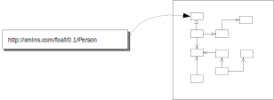
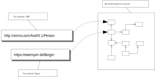
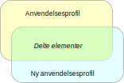
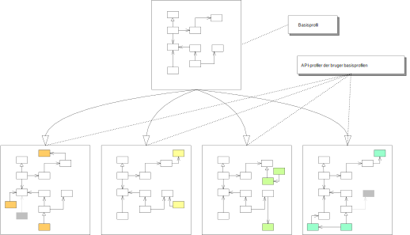

# Anvendelsesprofiler for semantisk interoperabilitet
I EU-regi defineres anvendelsesprofil blandt andet i _SEMIC Style Guide for Semantic Engineers_[^1]. Definitionen er her oversat fra engelsk via Google Translate med enkelte tilrettelser:
>#### Definition
>En anvendelsesprofil er en dataspecifikation, der har til formål at lette dataudvekslingen i en veldefineret anvendelseskontekst. Den genbruger begreber fra en eller flere semantiske dataspecifikationer, mens den tilføjer mere specificitet ved at identificere obligatoriske, anbefalede og valgfrie elementer, adressere særlige anvendelsesbehov og give anbefalinger til kontrollerede ordforråd, der skal bruges [dcat-ap].
>#### Beskrivelse
>En anvendelsesprofil (AP) er en dataformspecifikation, som adresserer særlige applikationsbehov (der opererer inden for et eller andet domæne eller et fællesskab), mens den giver semantisk interoperabilitet med andre applikationer baseret på en eller flere delte ontologier (vokabularer) [dc-ap].
Formelt omfatter anvendelsesprofilen (a) genbrugte ontologispecifikationer (en eller flere) og (b) dens egen dataformspecifikation. Eventuelt kan den inkludere (c) genbrugte dataformspecifikationer (en eller flere), og (d) den kan give sin egen ontologispecifikation for at udfylde de ontologiske huller. 
>   &nbsp;&nbsp;&nbsp;&nbsp;AP = 
>      &nbsp;&nbsp;&nbsp;&nbsp;&nbsp;&nbsp;&nbsp;&nbsp;&nbsp;&nbsp;&nbsp;&nbsp;genbrugt letvægtsontologi  + 
>      &nbsp;&nbsp;&nbsp;&nbsp;&nbsp;&nbsp;&nbsp;&nbsp;&nbsp;&nbsp;&nbsp;&nbsp;egen dataform  + 
>      &nbsp;&nbsp;&nbsp;&nbsp;&nbsp;&nbsp;&nbsp;&nbsp;&nbsp;&nbsp;&nbsp;&nbsp;(valgfrit) genbrugt (tilladende) dataform  + 
>      &nbsp;&nbsp;&nbsp;&nbsp;&nbsp;&nbsp;&nbsp;&nbsp;&nbsp;&nbsp;&nbsp;&nbsp;(eventuelt) egen ontologi 

I ovenstående definition står der at en anvendelsesprofil: 
> _genbruger begreber fra en eller flere semantiske dataspecifikationer_

Semantiske dataspecifikationer er i denne sammenhæng specifikationer – eller modeller -  der er defineres efter principperne for ’Resource Description Framework’ (RDF)   . 
RDF er en standardmodel for dataudveksling på nettet. RDF har funktioner, der letter datasammenfletning, selvom de underliggende skemaer er forskellige, og det understøtter specifikt udviklingen af skemaer over tid uden at kræve, at relaterede it-systemer skal ændres.
RDF bruger og udvider web’ets linkstruktur ved at bruge URIer – normalt HTTP-URIer – til entydigt at identificere eller navngive ’ting’ og relationen mellem ’ting’.  Ved at bruge denne enkle model tillader RDF, at data kan blandes, udstilles og deles på tværs af forskellige applikationer.
## En anvendelsesprofils bestanddele
Al modelarbejde – også det semantiske, også det der baseres på RDF – medfører valg mellem mulige måder at modellere et emne på. Skal specialisering af klasser udtrykkes som nye klasser med nedarvning eller skal der bruges klassifikationer i stedet? Skal en værdi kunne angives som fri tekst eller skal der bruges foruddefinerede enumerationer? Afhængigt af hvilke valg der træffes vil det være mere eller mindre nemt at se ligheder og sammenfald mellem modeller. Også de semantiske modeller.
En af metoderne til at øge den fælles forståelse, til at forbedre mulighederne for semantisk interoperabilitet, er at definere anvendelsesprofiler. Som beskrevet i definitionen af anvendelsesprofil fra SEMIC, så anvender en anvendelsesprofil elementer fra vokabularer og definerer regler og begrænsninger for elementernes brug. Men der foretages også modellerings valg ved udformningen af en anvendelsesprofil, eksempelvis i tilgang til nedarvning og i hvilke vokabular-elementer der skal foretrækkes. 
### ”Genbrugt letvægtsontologi + egen ontologi”
&nbsp;&nbsp;&nbsp;&nbsp;AP = 
&nbsp;&nbsp;&nbsp;&nbsp;&nbsp;&nbsp;&nbsp;&nbsp;&nbsp;&nbsp;&nbsp;&nbsp;**genbrugt letvægtsontologi  +** 
&nbsp;&nbsp;&nbsp;&nbsp;&nbsp;&nbsp;&nbsp;&nbsp;&nbsp;&nbsp;&nbsp;&nbsp;egen dataform  + 
&nbsp;&nbsp;&nbsp;&nbsp;&nbsp;&nbsp;&nbsp;&nbsp;&nbsp;&nbsp;&nbsp;&nbsp;(valgfrit) genbrugt (tilladende) dataform  + 
&nbsp;&nbsp;&nbsp;&nbsp;&nbsp;&nbsp;&nbsp;&nbsp;&nbsp;&nbsp;&nbsp;&nbsp;**(eventuelt) egen ontologi** 

Ontologi er en term der kan dække over både vokabular og anvendelsesprofil. Både ’letvægtsontologi’ og ’ontologi’ skal i dette afsnit forstås som ’vokabular’. 
Et vokabular (ordforråd) er en datamodel, der omfatter klasser, egenskaber og relationer, som kan bruges til at beskrive dine data og metadata. Vokabularets elementer defineres på en kontekstneutral måde. Hovedformålet er at datamodellens elementer skal kunne genbruges i den bredes mulige sammenhæng. 
Et vokabulars elementer kan hver for sig betragtes som en (atomar) semantisk byggeblok der kan kombineres med andre elementer fra andre vokabularer. 
#### Valg af genbrugeligt vokabular til anvendelsesprofil
For eksemplets skyld antager vi at der skal defineres en anvendelsesprofil om personer, en profil der skal kunne beskrive de mest almindeligt anvendte metadata til at beskrive en person i offentligt regi.
Ud af de omkring 50 vokabularer der umiddelbart kan findes hvor en Person-klasse indgår, vælges vokabularet FOAF (Friend of a Friend) ’  og fra den klassen’Person’. Valget træffes i denne situation ud fra et ønske om at anvende en klasse der har udbredt anvendelse og derfor kan forventes at medvirke til at lette interoperabilitet med andre semantiske datamodeller.

    

Anvendelsesprofil med brug af foaf:Person
#### Definition af eget vokabular
Er der til en anvendelsesprofil behov for elementer der ikke kan findes i eksisterende vokabularer, så kan de defineres i et nyt vokabular, af SEMIC kaldet ’egen ontologi’.
Anvendelsesprofilen om personer har her haft behov for en specifik klasse til beskrivelse af ’Borger’ og har derfor defineret den i et nyt vokabular – her blot kaldet ’Borger’ – og i samme vokabular erklæret at klassen Borger er en delmængde af klassen Person fra FOAF-vokabularet.
Borger-vokabularet er en selvstændig model der eksistere uafhængigt af anvendelsesprofilen. Den er blot skabt i relation til arbejdet med profilen og anvendes – helt eller delvist – af profilen.

    

Anvendelsesprofilen om personer er nu på vej til at blive en profil der kan skabe fælles forståelse og semantisk interoperabilitet mellem adskilte it-systemer. Nedenfor illustreres det at tre systemer har hver deres lokale definitioner og navngivninger af henholdsvis person og borger.

    

 

Ved at mappe de lokale metadata til en fælles definition og en entydig identifikation for henholdsvis ’Person’ og for ’Borger’, kan systemerne benytte et entydigt og maskinfortolkeligt fælles sprog til dataudvekling.

    

 
### ”Egen dataform + genbrugt dataform”

&nbsp;&nbsp;&nbsp;&nbsp;AP = 
&nbsp;&nbsp;&nbsp;&nbsp;&nbsp;&nbsp;&nbsp;&nbsp;&nbsp;&nbsp;&nbsp;&nbsp;genbrugt letvægtsontologi  + 
&nbsp;&nbsp;&nbsp;&nbsp;&nbsp;&nbsp;&nbsp;&nbsp;&nbsp;&nbsp;&nbsp;&nbsp;**egen dataform  +** 
&nbsp;&nbsp;&nbsp;&nbsp;&nbsp;&nbsp;&nbsp;&nbsp;&nbsp;&nbsp;&nbsp;&nbsp;**(valgfrit) genbrugt (tilladende) dataform  +** 
&nbsp;&nbsp;&nbsp;&nbsp;&nbsp;&nbsp;&nbsp;&nbsp;&nbsp;&nbsp;&nbsp;&nbsp;(eventuelt) egen ontologi 

En dataform eller en dataformbegrænsning, giver et sæt betingelser oven på en semantisk datamodel, betingelser der sætter begrænsninger for modellens anvendelse. Begrænsninger kan være som kardinalitet, logiske betingelser, tekststrenges længde eller mønstre og andet.
De betingelser og begrænsninger, der gælder for en given anvendelsesprofil, er givet som former eller mønstre udtrykt som en RDF-graf. Helt præcist udtrykkes dataformerne ved hjælp af ’Shape Constraint Language’ (SHACL) .
’Egen dataform’ skal altså forstås som en SHACL-definition specifikt for den pågældende anvendelsesprofil. 
’Genbrugt dataform’ er aktuel i de tilfælde hvor en anvendelsesprofil ’A’ har genbrugt en anden anvendelsesprofil ’B’, helt eller delvist. Anvendelsesprofil ’A’ genbruger SHACL-specifikationen fra anvendelsesprofil ’B’, hvis det ønskes at anvendelsesprofil ’A’ skal kunne erklæres at være kompatibel med anvendelsesprofil ’B’.
 
# Profiltyper
Anvendelsesprofiler er normalt tiltænkt et særligt formål, et formål der kan påvirke udformningen af profilen. For at kunne tale mere præcist om en anvendelsesprofil anbefales det at bruge typer som ’Basisprofil’, ’API-profil’ og ’Fødereret API-profil’.
Typernes indbyrdes overordnede sammenhæng illustreres her:

    

 
## Basisprofil
Basisprofiler oprettes med fokus på at lette arbejdet med udformning af API-profiler samt at skabe grundlag for integrationen mellem profiler i et semantisk fællesskab.
En basisprofil indeholder et sæt af metadata omkring et emneområde og så vidt muligt kun om det ene emne. Basisprofil skal ikke beskrive alle aspekter af et emneområde, men skal fokusere på de metadata der vurderes at kunne få bred anvendelse.
Basisprofilen udgør en fælles kerne, der kan udvides med yderligere kontekstafhængige oplysninger, i de mere specifikke API-profiler. Informationer dannet på baggrund af to eller flere anvendelsesprofiler kan potentielt bringes til at hænge sammen via denne fælles kerne.
I API-profiler skal basisprofilens elementer indgå i så stort et omfang som muligt for at give det bedst mulige grundlag for efterfølgende at skabe sammenhæng mellem datasæt etableret på baggrund af ellers forskelligartede it-system-profiler.

    

 
### Basisprofilers udvikling
Ideelt set vil en basisprofil være udviklet på baggrund af alle potentielt relevante it-systemers håndtering af det emne basisprofilen har fokus på og kunne derfor forventes at være uforanderlig over tid. Den virkelige verden er anderledes. Selv hvis der i udformningen af en basisprofil er taget højde for kendte eksisterende og relevante it-systemer, så vil der både ske ændringer i de pågældende it-systemer og der vil komme nye it-systemer til. 

    

Konstateres det at to eller flere API-profiler anvender et element der ikke er en del af basisprofilen, så bør det føre til at det vurderes om elementet skal gøres til en del af basisprofilen. 

    

Hvis vurderingen falder positivt ud, så skabes der en ny udgave af basisprofilen.
## API-profiler
En API-profil defineres som en anvendelsesprofil der repræsenterer den datamodel et it-system API har. 
API-profiler kan være defineret både med og uden brug af en basisprofil. 

    

 

Hvis en basisprofil bruges vil API-profilens behov afgøre om basisprofilens elemener benyttes som de er eller om der skal anvendes specialiseringer af klasser, egenskaber og datatyper.
Desuden kan en API-profil tilføje egne klassifikationer og indsnævre multipliciteter.
Basisprofiler udformes med de metadata der anses for at være dækkende for et bredt felt af den type data profilen er oprettet for.  Det betyder to ting:
*	at APIer kan give adgang til data der ikke er dækket af en basisprofil, men af APIet relaterede profil. 
*	at ikke alle APIer kan returnere eller håndtere alle data repræsenteret i en basisprofil.

    

 
 
API-profilen kan fravælge elementer fra basisprofilen. Her markeret som grå
## Fødereret API-profil
En fødereret API-profil er en profil der anvendes til at beskrive et API der kan foretage fødereret søgning. 
Fødereret søgning er en teknik, der bruges til at søge i flere datakilder på én gang. Med fødereret søgning hentes data fra flere datakilder med én forespørgsel. Via det API der forespørges på fordeles forespørgslen til de underliggende datakilder. 
Til et fødereret API oprettes en fødereret API-profil der samlet inkluderer og repræsenterer de underliggende datakilders API-profiler.

    

  

I nedenstående illustration har alle profilerne helt eller delvist genbrugt elementer fra samme basisprofil. Det er ikke en nødvendighed for at skabe et fødereret API. En fødereret profil opbygges på baggrund af de API-profiler der eksempelvis ønskes foretaget en fødereret søgning på, uanset om disse APIer ha en fælles basisprofil eller om de er skabt helt uafhængigt af andre profiler.

    

  

# Eksempler på anvendelsesprofiler
Nedstående liste er eksempler på anvendelsesprofiler udviklet i FDA-regi. 
* Anvendelsesprofil for organisationer 
&nbsp;&nbsp;&nbsp;&nbsp;https://arkitektur.digst.dk/specifikationer/organisation/anvendelsesprofil-organisationer  
* Anvendelsesprofil for klassifikationer 
&nbsp;&nbsp;&nbsp;&nbsp;https://arkitektur.digst.dk/specifikationer/klassifikation/anvendelsesprofil-klassifikationer 
* DCAT-AP-DK: Dansk anvendelsesprofil til beskrivelse af datasæt og datakataloger  
&nbsp;&nbsp;&nbsp;&nbsp;https://digst.github.io/DCAT-AP-DK/releases/v.2.0/docs/ 
* Standard for beskrivelse af it-systemer - basisprofil 
&nbsp;&nbsp;&nbsp;&nbsp;https://digst.github.io/IT-System-AP/SYS-AP/docs/ 
* langDCAT-AP: Anvendelsesprofil til beskrivelse af sprogteknologiske datasæt  
&nbsp;&nbsp;&nbsp;&nbsp;https://github.com/digst/langDCAT-AP  

[^1]:  https://semiceu.github.io/style-guide/1.0.0/terminological-clarifications.html#sec:what-is-an-ap-specification
